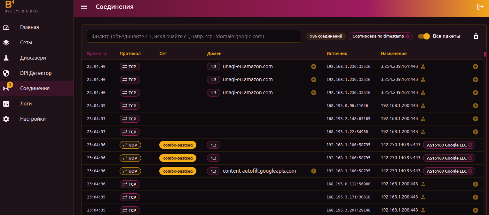

# Соединения

Раздел отображает TCP/UDP-соединения, проходящие через b4, в реальном времени. Данные поступают через WebSocket — таблица обновляется непрерывно.

## Таблица соединений

### Столбцы

| Столбец | Описание |
| --- | --- |
| **Время** | Время соединения (ЧЧ:ММ:СС), моноширинный шрифт |
| **Протокол** | Цветная метка: `TCP`, `UDP`, `P-TCP`, `P-UDP` |
| **Сет** | Название сета, если соединение обрабатывается. Пустое — соединение прошло без модификации |
| **Домен** | SNI-домен из TLS/QUIC-рукопожатия. Рядом метка версии TLS (1.2 / 1.3) |
| **Источник** | IP отправителя. Если устройство опознано — показывает имя или vendor в виде метки |
| **Назначение** | IP:порт получателя. Возможность определить ASN и добавить IP в сет |

:::info Протоколы P-TCP и P-UDP
Префикс **P** означает, что соединение прошло через встроенный SOCKS5-прокси b4, а не через перехват на уровне netfilter.
:::

:::info Метки TLS
Метки **1.2** и **1.3** рядом с доменом — версия протокола TLS. Провайдеры могут блокировать TLS 1.2 и 1.3 разными методами, поэтому для них могут потребоваться разные стратегии обхода. Сеты можно настроить на конкретную версию TLS во вкладке [Цели](./sets/targets).
:::

---

## Добавление доменов в сеты

Если домен не входит ни в один сет, рядом с ним отображается иконка **+**. При нажатии открывается диалог добавления:

<!-- screenshot: диалог добавления домена -->

1. **Выбор шаблона домена** — от точного до широкого:
   - `rr1---sn-ab5l6ne7.googlevideo.com` — самый точный, только это имя хоста
   - `*.googlevideo.com` — промежуточная точность
   - `*.*.googlevideo.com` — самый широкий, все поддомены

2. **Выбор сета** — в какой сет добавить домен (выпадающий список включённых сетов)

3. Нажмите **Добавить домен**

:::tip
Для YouTube и подобных сервисов, которые используют множество CDN-поддоменов, выбирайте широкий шаблон (например, `*.googlevideo.com`). Иначе придётся добавлять каждый поддомен отдельно.
:::

Если домен уже в сете — вместо **+** отображается серая галочка.

---

## Добавление IP/CIDR в сеты

Клик по иконке **+** рядом с IP назначения открывает диалог с информацией об IP.

<!-- screenshot: диалог добавления IP -->

### Обогащение данных

Перед добавлением можно получить информацию об IP:

| Кнопка | Источник | Что показывает |
| --- | --- | --- |
| **Загрузить сетевую информацию** | RIPE NCC | ASN, анонсированные префиксы |
| **Обогатить через IPInfo** | ipinfo.io | Организация, hostname, расположение, координаты |

:::info IPInfo
Для использования IPInfo необходимо указать токен API в [Настройки → Основные](./settings/core). Бесплатный токен можно получить на [ipinfo.io](https://ipinfo.io).
:::

### Варианты добавления

**Если ASN найден** — b4 загружает все анонсированные IP-префиксы этого ASN:

- **Добавить только IP** — один конкретный адрес
- **Добавить все N префиксов** — все IP-диапазоны организации

**Если ASN не найден** — выбор CIDR-маски вручную:

| Маска | Описание |
| --- | --- |
| `/32` | Один IP-адрес |
| `/24` | ~256 IP — локальная подсеть |
| `/16` | ~65K IP — сетевой блок |
| `/8` | ~16M IP — класс A |

Для IPv6 доступны маски `/128`, `/64`, `/48`, `/32`.

### ASN в таблице

После обогащения рядом с IP назначения отображается метка **ASxxxxx**. ASN-данные кэшируются в браузере. Метку можно удалить, нажав на крестик.

Для быстрого определения ASN без открытия диалога — нажмите иконку сети рядом с IP.

---

## Фильтрация

Поле фильтра в верхней панели поддерживает комбинирование условий:

- `+` — объединение (AND)
- `!` — исключение (NOT)
- Фильтр по полям: `protocol:`, `domain:`, `asn:`, `device:`, `alias:`

### Примеры

| Фильтр | Что покажет |
| --- | --- |
| `tcp` | Все TCP-соединения |
| `domain:youtube` | Соединения с «youtube» в домене |
| `tcp+!domain:google.com` | TCP-соединения, кроме Google |
| `protocol:udp+domain:discord` | UDP-соединения к Discord |
| `asn:AS13335` | Соединения к Cloudflare |
| `device:iPhone` | Соединения от устройства с именем iPhone |

Фильтр сохраняется между сессиями.

При активном фильтре в панели отображается количество отфильтрованных соединений. Сортировку можно сбросить кнопкой **×** рядом с индикатором сортировки.

---

## Режим отображения

Переключатель в верхней панели:

| Режим | Описание |
| --- | --- |
| **Только домены** | Показывает только соединения с распознанным SNI-доменом. Режим по умолчанию |
| **Все пакеты** | Показывает весь перехваченный трафик, включая пакеты без домена |

:::tip
Режим **Все пакеты** полезен для диагностики — можно увидеть, какой трафик b4 перехватывает, но не может распознать. В обычной работе достаточно режима **Только домены**.
:::

---

## Управление потоком

Данные поступают непрерывно. Таблица автоматически прокручивается к последним записям. Если прокрутить вверх — автопрокрутка останавливается, и в правом нижнем углу появляется кнопка возврата вниз.

### Горячие клавиши

| Клавиша | Действие |
| --- | --- |
| **P** или **Pause** | Пауза / возобновление потока. При паузе рамка таблицы подсвечивается |
| **Ctrl+X** или **Delete** | Очистить таблицу |

### Кнопка очистки

Иконка корзины в верхней панели очищает все отображаемые соединения.

---

## Метка непросмотренных доменов

В боковом меню рядом с пунктом **Соединения** может отображаться счётчик — количество новых соединений, которые совпали с сетом, пока вы находились на другой странице. Счётчик сбрасывается при переходе на страницу соединений.
