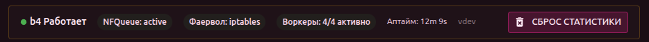
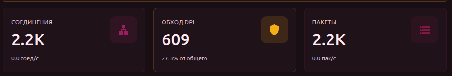
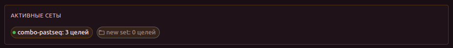
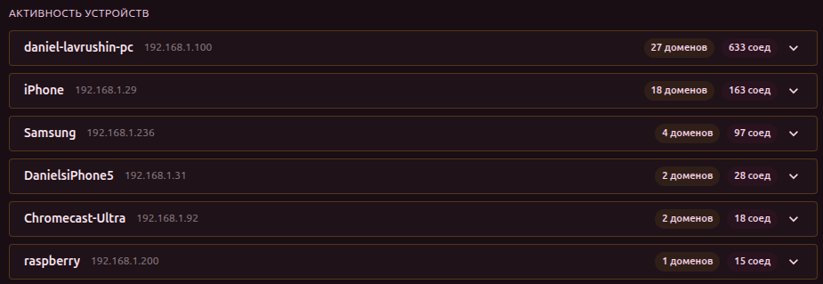
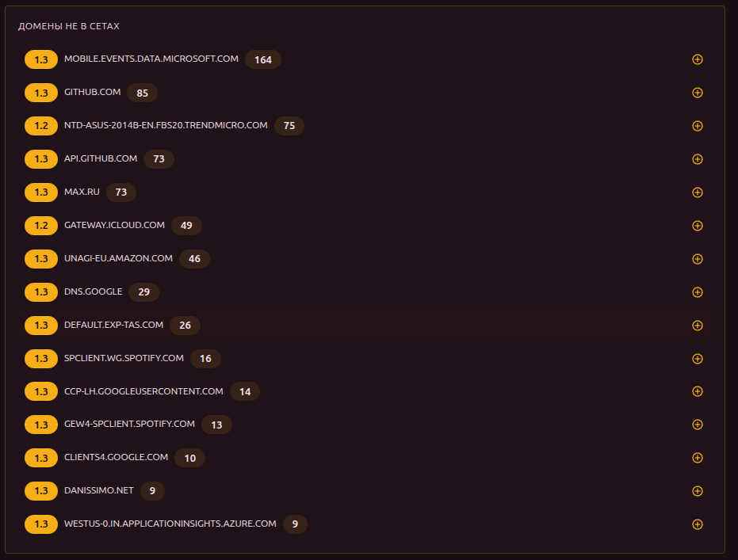

# Дашборд

Главная страница, которая открывается по умолчанию. Показывает текущее состояние b4, метрики и активность устройств в сети.

## Состояние системы

Баннер в верхней части страницы отображает:

- **Статус** — Работает / Нестабильно / Критично
- **NFQueue** — состояние очереди netfilter
- **Фаервол** — состояние правил iptables/nftables
- **Воркеры** — сколько рабочих потоков активно (например, «3/4 активно»)
- **Аптайм** — время работы с последнего запуска
- **Версия** — текущая версия b4

Здесь же есть кнопка **Сброс статистики** для обнуления всех счётчиков.

## Метрики

Три карточки с основными показателями:

| Метрика | Что показывает |
| --- | --- |
| **Соединения** | Общее количество соединений и текущая скорость (соед/с) |
| **Обход DPI** | Количество соединений, обработанных сетами, и процент от общего |
| **Пакеты** | Количество обработанных пакетов и текущая скорость (пак/с) |

Ниже отображается график **Скорость соединений** — линейный график в реальном времени.

## Активные сеты

Список включённых сетов с количеством целей (доменов + IP). Клик по сету переходит к его редактированию.

## Активность устройств

Показывает, какие устройства в сети к каким доменам обращаются:

- **Заголовок устройства** — имя (или MAC/vendor), IP, количество доменов и соединений
- **Раскрываемый список доменов** — для каждого домена показано количество соединений

Если домен ещё не добавлен ни в один сет, рядом с ним отображается кнопка «+» для быстрого добавления.

:::info Метки TLS
Рядом с доменами могут отображаться метки **1.2** или **1.3** — это версия протокола TLS, которую использует соединение. Такие же метки встречаются в разделах Соединения и Дискавери. Версия TLS важна, потому что провайдеры могут блокировать TLS 1.2 и TLS 1.3 разными методами — для них могут потребоваться разные стратегии обхода.
:::

## Домены не в сетах

Топ-15 доменов, которые обрабатываются b4, но не включены ни в один сет. Отсортированы по количеству соединений. Каждый домен можно добавить в сет через кнопку «+».

