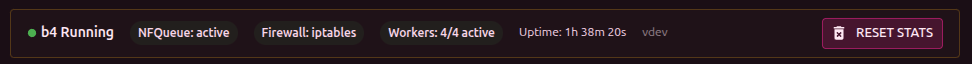
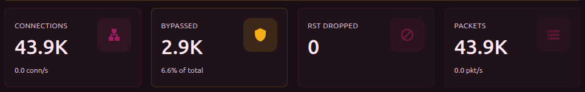
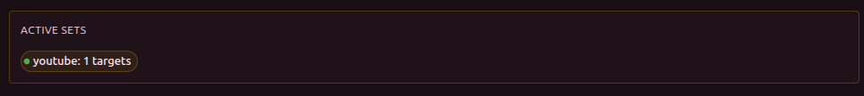
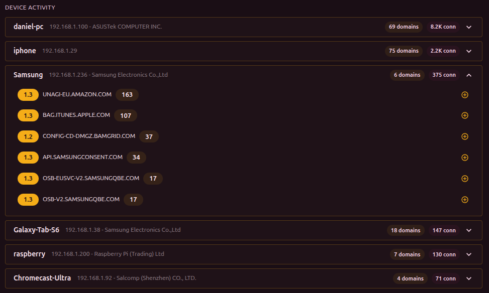
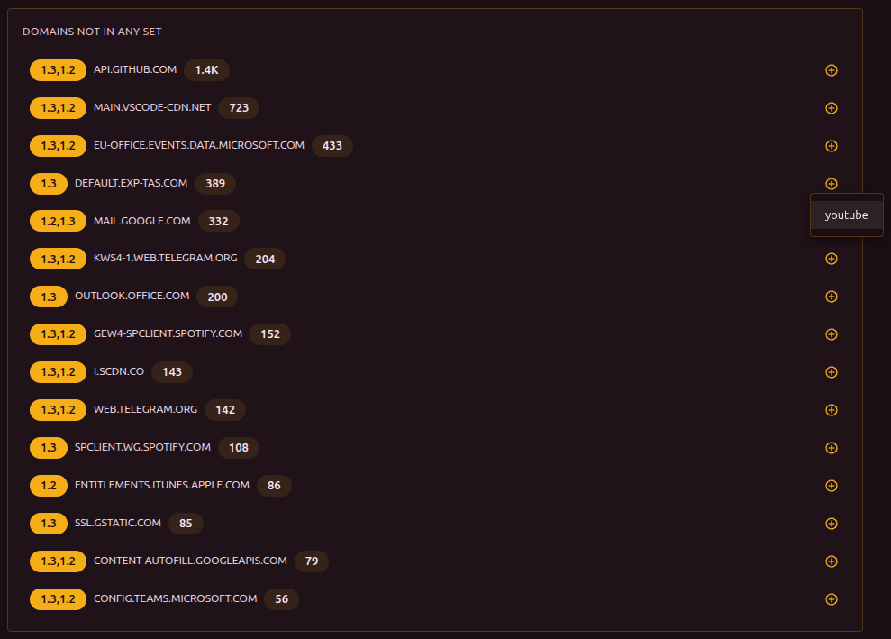

The main page that opens by default. It shows the current state of b4, metrics, and device activity on the network.

## System status

The banner at the top of the page shows:

- **Status** - Running / Unstable / Critical
- **NFQueue** - state of the netfilter queue
- **Firewall** - state of iptables/nftables rules
- **Workers** - how many worker threads are active (for example, "3/4 active")
- **Uptime** - time since the last start
- **Version** - current b4 version

The same banner has a **Reset statistics** button to zero all counters.

## Metrics

Three cards with the main indicators:

| Metric | Shows |
| --- | --- |
| **Connections** | Total number of connections and current rate (conn/s) |
| **DPI bypass** | Number of connections handled by sets, and the share of the total |
| **Packets** | Number of processed packets and current rate (pkt/s) |

Below is a **Connection rate** chart - a real-time line chart.

## Active sets

A list of enabled sets with the number of targets (domains + IPs). Clicking a set opens it for editing.

## Device activity

Shows which devices on the network access which domains:

- **Device header** - name (or MAC/vendor), IP, number of domains and connections
- **Expandable domain list** - each domain shows its number of connections

If a domain is not yet in any set, a "+" button appears next to it for quick addition.

:::info TLS labels
Domains may be tagged with **1.2** or **1.3** - the TLS protocol version used by the connection. The same labels appear in the Connections and Discovery sections. The TLS version matters because providers may block TLS 1.2 and TLS 1.3 with different methods - each may require a different bypass strategy.
:::

## Domain watchdog

If [domain watchdog](./watchdog) is enabled, a watchdog panel appears on the dashboard. It shows the status of each monitored domain, the time of the last check, and the error count. From here you can also add a new domain or trigger a forced check.

## Domains not in sets

Top 15 domains handled by b4 that are not yet included in any set. Sorted by number of connections. Each domain can be added to a set through the "+" button.

