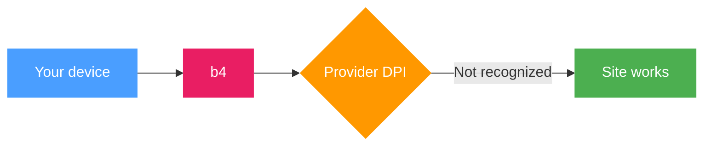

## What b4 is

**b4** (Bye Bye Big Bro) is a service that helps open websites blocked by your internet provider. Providers use DPI technology (Deep Packet Inspection) to recognize and block traffic to specific resources. b4 modifies network packets so that the blocking system cannot recognize them - the destination site still receives the data unchanged and works as usual.

b4 runs on Linux devices: regular computers, servers, and routers. When installed on a router, bypass works for every device on the home network without any configuration on the individual devices.

Management is done through a **web interface** in the browser.

## How it works

**Without b4:** you open a site - the provider sees where you are going and blocks the connection.

**With b4:** packets are modified before they reach the provider. The DPI system cannot determine which site you are requesting and lets the traffic through. The site itself reassembles the packets and works normally.

Main bypass methods:

- **Fragmentation** - the request is split into parts that the DPI cannot reassemble
- **Faking** - sending decoy packets that confuse the DPI
- **Modification** - altering packet header fields so they do not match blocking signatures

You do not need to understand the details - b4 includes an automatic mechanism that picks a working configuration for your provider.

## Main features

b4 consists of several parts, each described in detail in its own documentation section:

- **Sets** - bypass configurations for TCP/UDP traffic with different strategies
- **Discovery** - automatic selection of a working configuration
- **DPI Detector** - identifies the blocking methods used by your provider
- **Connections monitor** - view traffic in real time
- **GeoSite/GeoIP** - work with site categories and IP addresses
- **Per-device filtering** - different rules for different devices on the network
- **Routing** - direct traffic through a specific interface (VPN, WireGuard, etc.)
- **SOCKS5 proxy** - for applications that support proxies
- **MTProto proxy** - a proxy for Telegram

## System requirements

### Supported platforms

| Platform | Description |
| --- | --- |
| Linux | Any distribution with kernel 3.13+ (Ubuntu, Debian, Alpine, etc.) |
| OpenWRT | Routers running OpenWRT firmware |
| ASUS Merlin | ASUS routers with Merlin firmware (via Entware) |
| Keenetic | Keenetic routers with OPKG support |
| MikroTik | RouterOS 7.x with container support |
| Docker | Any system with Docker |

### Supported architectures

`amd64`, `arm64`, `armv7`, `armv6`, `armv5`, `386`, `mips`, `mipsle`, `mips64`, `mips64le`

### Minimum requirements

- **RAM:** 64 MB of free memory
- **Disk:** ~30 MB for the binary plus space for configuration and geodata
- **Linux kernel:** 3.13+ with NFQUEUE support (`nfnetlink_queue`)
- **Privileges:** root (required for netfilter)

:::info
When installed on a router, bypass works for every device on the network without any per-device setup.
:::
