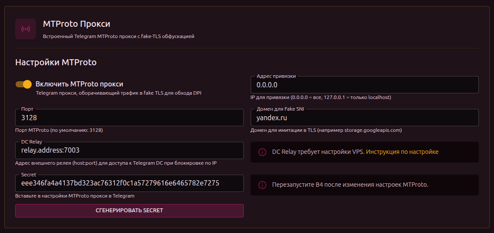
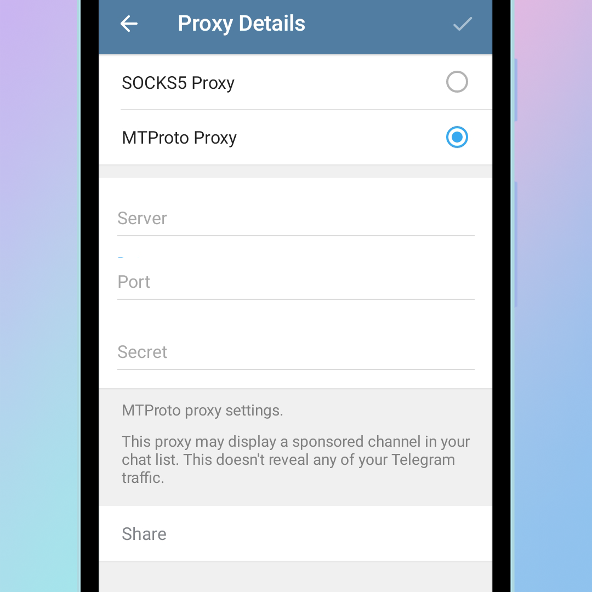

# MTProto Прокси для Telegram

B4 включает встроенный прокси для Telegram, который маскирует трафик под обычное HTTPS-соединение к популярному сайту.

## Два сценария использования



### Сценарий 1: B4 на VPS за границей (простой)

B4 установлен на сервере за пределами цензурированной зоны. Пользователи из России подключают Telegram напрямую к VPS.

```text
Телефон (Россия) ──────▶ B4 на VPS ──────▶ Telegram
                 ТСПУ видит
              «HTTPS к google.com»
               (не блокирует)
```

Настройка занимает 2 минуты. Дополнительное ПО не требуется.

### Сценарий 2: B4 на роутере внутри России (с relay)

B4 установлен на роутере или машине внутри России. Требуется дополнительный VPS для пересылки трафика, так как ТСПУ блокирует все прямые соединения к серверам Telegram по IP.

```text
Телефон ──────▶ B4 (роутер) ──────▶ VPS ──────▶ Telegram
        ТСПУ видит              ТСПУ видит
     «HTTPS к google.com»    «трафик к VPS»
      (не блокирует)         (не блокирует)
```

На VPS достаточно запустить простую пересылку трафика — без ключей и настроек.

---

## Сценарий 1: B4 на VPS

### Шаг 1: Настройка B4

В веб-интерфейсе B4 → **Settings** → **General** → **MTProto Proxy**:

1. **Enable MTProto Proxy** — включить
2. **Port** — порт для подключений (рекомендуется `443`)
3. **Fake SNI Domain** — домен для маскировки (например `storage.googleapis.com`)
4. Нажать **Generate Secret**
5. Скопировать значение из поля **Secret**
6. Сохранить настройки и перезапустить B4

Поле **DC Relay** оставить пустым — B4 на VPS подключается к Telegram напрямую.

### Шаг 2: Настройка Telegram

1. Открыть **Telegram** → **Настройки** → **Данные и память** → **Прокси**
2. Нажать **Добавить прокси**
3. Выбрать тип **MTProto**
4. Заполнить:
   - **Сервер**: IP-адрес или домен VPS
   - **Порт**: порт из шага 1
   - **Секрет**: скопированный секрет
5. Нажать **Готово** и включить прокси


---

## Сценарий 2: B4 на роутере внутри России

### Шаг 1: Подготовка VPS

На любом VPS за границей запустить пересылку трафика:

```bash
# Установка socat
apt install -y socat

# Запуск пересылки (при необходимости заменить 7007 на другой начальный порт)
socat TCP-LISTEN:7007,fork,reuseaddr TCP:149.154.175.50:443 &
socat TCP-LISTEN:7008,fork,reuseaddr TCP:149.154.167.51:443 &
socat TCP-LISTEN:7009,fork,reuseaddr TCP:149.154.175.100:443 &
socat TCP-LISTEN:7010,fork,reuseaddr TCP:149.154.167.91:443 &
socat TCP-LISTEN:7011,fork,reuseaddr TCP:149.154.171.5:443 &
```

Больше ничего на VPS настраивать не нужно. Никаких ключей, секретов или дополнительного ПО.

:::warning Порты
B4 использует **5 последовательных портов** начиная с указанного. Например, при начальном порте `7007` должны быть открыты порты `7007`–`7011` в firewall VPS. Каждый порт соответствует одному из 5 дата-центров Telegram.
:::

:::tip
Для автозапуска можно добавить команды в `/etc/rc.local` или создать systemd-сервис.
:::

### Шаг 2: Настройка B4

В веб-интерфейсе B4 → **Settings** → **General** → **MTProto Proxy**:

1. **Enable MTProto Proxy** — включить
2. **Port** — порт для подключений (например `7002`)
3. **Fake SNI Domain** — домен для маскировки (например `storage.googleapis.com`)
4. **DC Relay** — адрес VPS с начальным портом (например `my-vps.com:7007`)
5. Нажать **Generate Secret**
6. Скопировать значение из поля **Secret**
7. Сохранить настройки и перезапустить B4

### Шаг 3: Настройка Telegram

1. [Открыть](https://core.telegram.org/proxy#adding-a-proxy) **Telegram** → **Настройки** → **Данные и память** → **Прокси**
2. Нажать **Добавить прокси**
3. Выбрать тип **MTProto**
4. Заполнить:
   - **Сервер**: IP-адрес роутера или машины с B4
   - **Порт**: порт из шага 2
   - **Секрет**: скопированный секрет
5. Нажать **Готово** и включить прокси

---

## Выбор домена для маскировки

Домен должен быть:

- популярным в России
- незаблокированным
- критически важным (блокировка такого домена нарушит работу других сервисов)

:::info
При подключении к порту B4 без правильного секрета — B4 прозрачно перенаправляет на настоящий сайт (указанный в Fake SNI). Сканер видит обычный сайт, а не прокси.
:::

## Что-то пошло не так, памагити

### Telegram показывает "Подключение..."

- Убедиться, что `socat` запущен на VPS и порты доступны (сценарий 2)
- Проверить правильность адреса VPS в поле DC Relay
- В логах B4 должны быть строки `MTProto fake-TLS handshake OK` и `MTProto relay`

### Неправильный секрет

В логах: `HMAC verification failed`

Секрет в Telegram не совпадает с секретом в B4.

### Расхождение времени

В логах: `timestamp out of range`

Часы на устройстве и на машине с B4 расходятся. Необходимо синхронизировать время.

### VPS недоступен

В логах: `dial DC ... i/o timeout`

- VPS выключен или `socat` не запущен
- Firewall на VPS блокирует входящие соединения на нужных портах

### Нет ответа от Telegram

В логах: `DC->client: 0 bytes`

- Если DC Relay **не настроен**: серверы Telegram заблокированы по IP. Необходимо настроить VPS relay (придется использовать только сценарий 2).
- Если DC Relay **настроен**: `socat` на VPS не запущен или указан неправильный порт.
