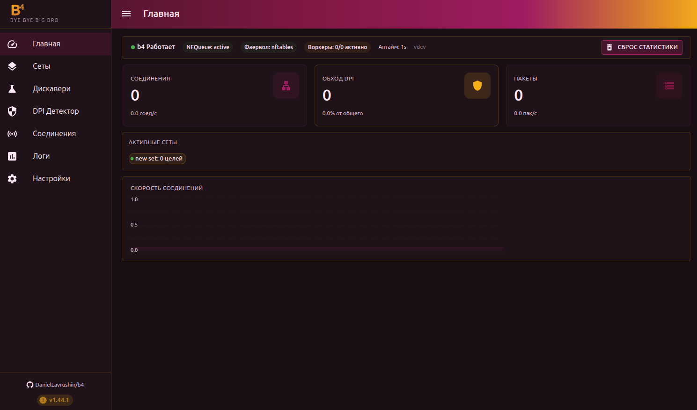
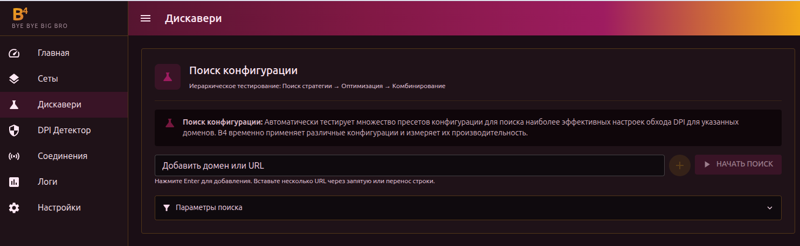
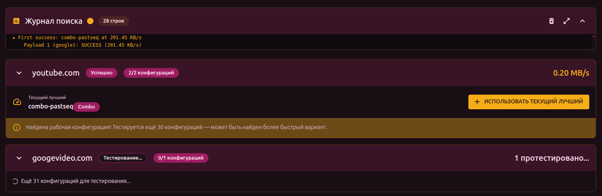
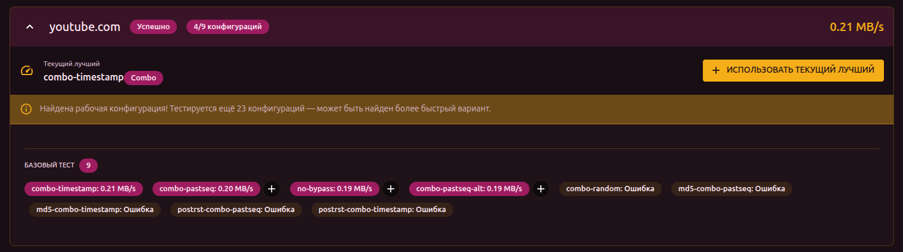
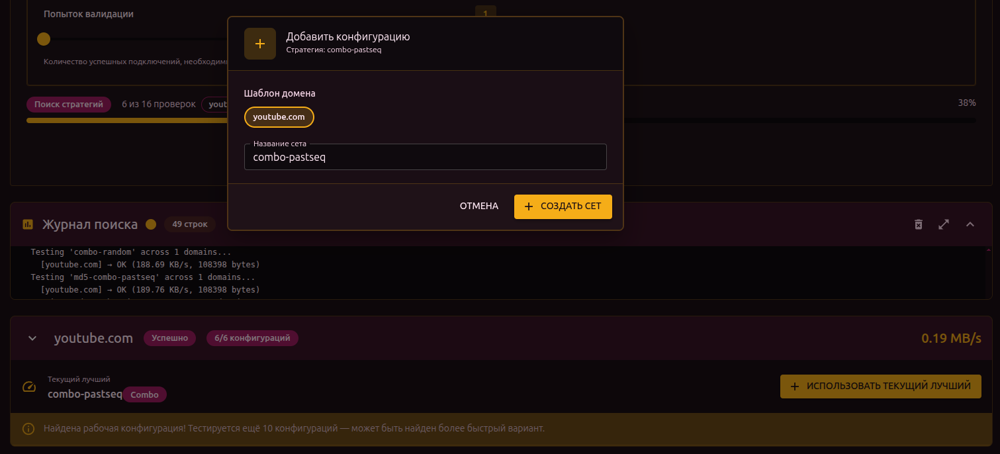
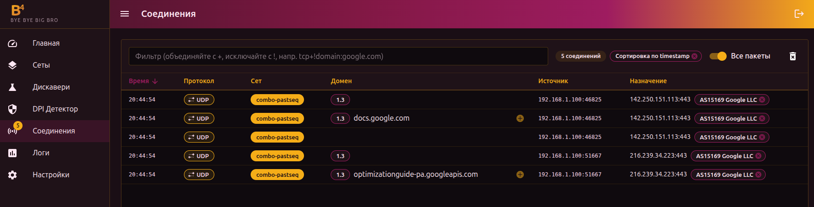

## Обзор

После установки b4 запускается как сервис и становится доступен через веб-интерфейс. Эта страница описывает путь от первого запуска до работающего обхода блокировок.

## Открыть веб-интерфейс

Откройте в браузере:

```text
http://<IP-адрес>:7000
```

Где `<IP-адрес>` — адрес устройства, на котором установлен b4:

- Если b4 на этом же компьютере: `http://localhost:7000`
- Если на роутере: `http://192.168.1.1:7000` (подставьте IP роутера)

:::info HTTPS
Если в настройках b4 включён HTTPS, используйте `https://` вместо `http://`. Браузер может показать предупреждение о сертификате — это нормально для самоподписанного сертификата, его можно принять.
:::



При первом запуске дашборд будет пустым — это нормально. Данные появятся после настройки.

## Запустить обнаружение

b4 может автоматически подобрать рабочую конфигурацию для вашего провайдера. Для этого используется раздел **Дискавери**.

### Шаг 1: Перейти в Дискавери

В боковом меню нажмите **Дискавери**.



### Шаг 2: Добавить домены

В поле **Добавить домен или URL** введите адрес заблокированного сайта и нажмите Enter. Можно добавить несколько доменов через запятую.

Примеры:

- `youtube.com`
- `googlevideo.com`


### Шаг 3: Начать поиск

Нажмите **Начать поиск**.

b4 начнёт перебирать стратегии обхода и тестировать их на указанных доменах. Процесс проходит несколько фаз:

1. **Базовый тест** — проверка, действительно ли сайт заблокирован
2. **Поиск стратегий** — перебор методов обхода
3. **Оптимизация** — подбор параметров
4. **Тест комбинаций** — проверка комбинированных стратегий
5. **Проверка DNS** — проверка DNS-блокировки



Поиск может занять от 1 до 10 минут в зависимости от провайдера.

:::tip Пропустить проверку DNS
Если вы уверены, что DNS работает нормально (например, используете DoH или сторонний DNS-сервер), включите опцию **Пропустить поиск DNS** в **Параметрах поиска**. Это ускорит процесс и уберёт ложные срабатывания по DNS.
:::

### Шаг 4: Результаты

После завершения для каждого домена отображается результат:

- **Успешно** — найдена рабочая конфигурация
- **Заблокирован** — сайт заблокирован на уровне DNS или транспорта, нужны дополнительные настройки



## Применить конфигурацию

На карточке успешного результата нажмите **Использовать эту конфигурацию**.



В открывшемся диалоге:

1. Выберите **Создать новый сет** (или **Добавить в существующий похожий сет**, если у вас уже есть настроенные сеты)
2. Укажите название сета (или оставьте предложенное)
3. Нажмите **Создать сет**

Сет — это набор настроек обхода, привязанный к списку доменов или ip адресов. Подробнее о сетах — в разделе [Сеты](./sets/).

## Проверить работу

### Через браузер

Откройте сайт, для которого настроен обход. Если всё работает — сайт загрузится.

### Через раздел Соединения

В боковом меню нажмите **Соединения**. Здесь отображаются все текущие TCP/UDP-соединения в реальном времени.



Если обход работает, в столбце **Сет** напротив соединений с настроенным доменом будет отображаться название вашего сета.

## Что дальше

- Добавить другие домены — через Дискавери или вручную в настройках сета

- Настроить обход по категориям (GeoSite) — чтобы не добавлять домены по одному
- Посмотреть раздел [Сеты](./sets/) для подробного описания всех возможностей
