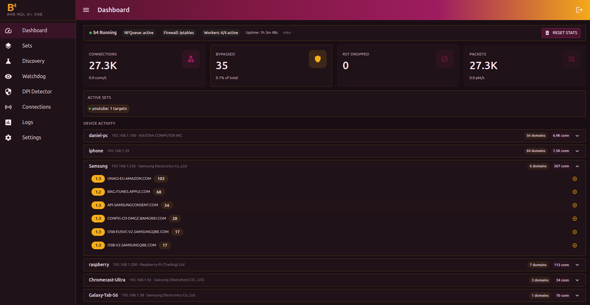
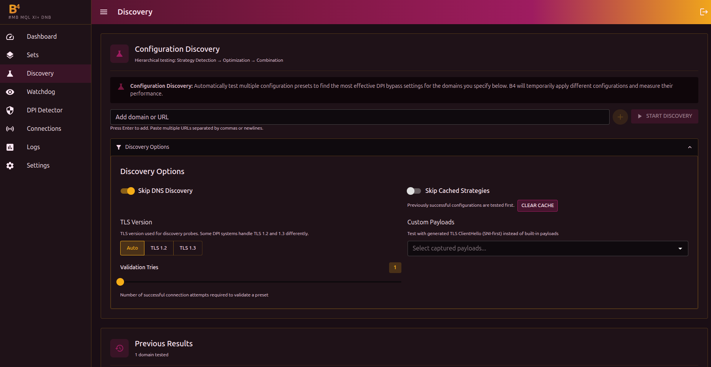
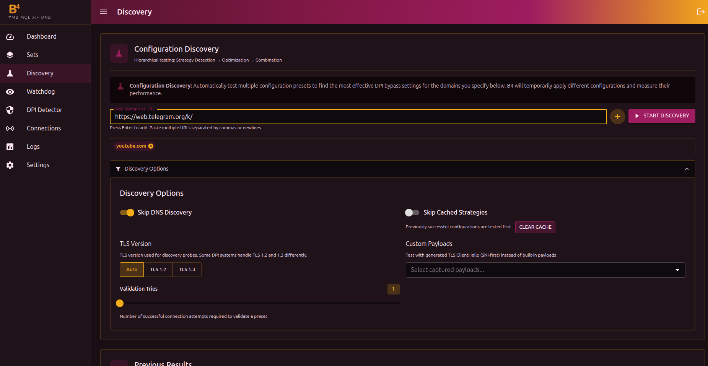
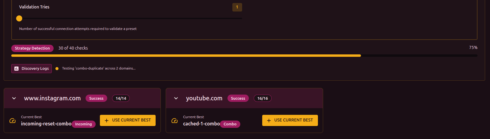
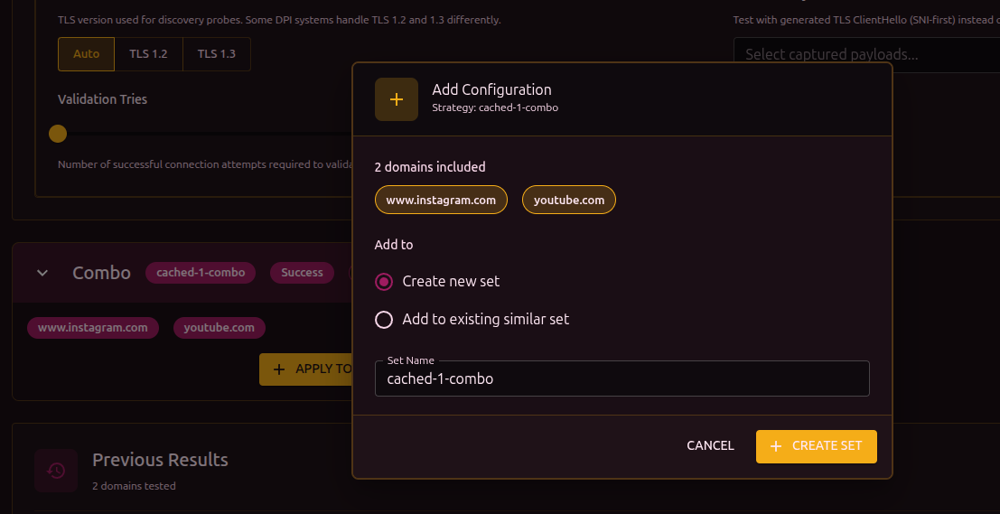
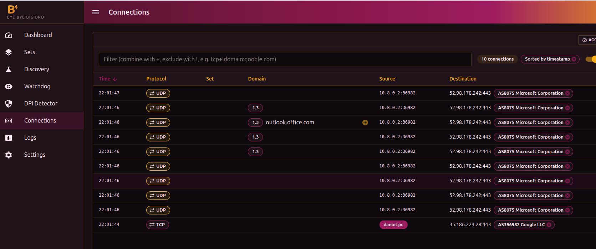

## Overview

After installation, b4 runs as a service and is available through the web interface. This page walks through the path from first launch to a working bypass.

## Open the web interface

Open in the browser:

```text
http://<IP-address>:7000
```

Where `<IP-address>` is the address of the device where b4 is installed:

- If b4 is on the same computer: `http://localhost:7000`
- If on a router: `http://192.168.1.1:7000` (use the router's IP)

:::info HTTPS
If HTTPS is enabled in b4 settings, use `https://` instead of `http://`. The browser may show a certificate warning - that is expected with a self-signed certificate and can be accepted.
:::



On first launch the dashboard will be empty - that is normal. Data appears after configuration.

## Run discovery

b4 can automatically pick a working configuration for your provider. This is done in the **Discovery** section.

### Step 1: Open Discovery

In the side menu click **Discovery**.



### Step 2: Add domains

In the **Add domain or URL** field enter a blocked site address and press Enter. You can add several domains separated by commas.

Examples:

- `youtube.com`
- `googlevideo.com`



### Step 3: Start the search

Click **Start search**.

b4 iterates through bypass strategies and tests them against the listed domains. The process goes through several phases:

1. **Basic test** - check whether the site is actually blocked
2. **Strategy search** - iterate through bypass methods
3. **Optimization** - tune parameters
4. **Combination test** - check combined strategies
5. **DNS check** - check for DNS-based blocking



The search can take from 1 to 10 minutes depending on the provider.

:::tip Skip DNS check
If you are sure DNS works normally (for example, you use DoH or a third-party DNS server), enable **Skip DNS search** in **Search parameters**. This speeds up the process and removes false DNS-related results.
:::

### Step 4: Results

After the search finishes, each domain shows a result:

- **Success** - a working configuration was found
- **Blocked** - the site is blocked at the DNS or transport layer and needs additional settings



## Apply the configuration

On a successful result card click **Use this configuration**.

In the dialog that opens:

1. Choose **Create a new set** (or **Add to an existing similar set** if you already have configured sets)
2. Enter the set name (or keep the suggested one)
3. Click **Create set**

A set is a bundle of bypass settings tied to a list of domains or IP addresses. More on sets in the [Sets](./sets/) section.

## Verify it works

### Through the browser

Open a site that is covered by the bypass. If everything works, the site loads.

### Through the Connections section

In the side menu click **Connections**. This view shows all current TCP/UDP connections in real time.



If the bypass is working, the **Set** column for connections to the configured domain shows the name of your set.

## What's next

- Add more domains - through Discovery or manually in the set settings
- Configure bypass by category (GeoSite) - to avoid adding domains one by one
- See the [Sets](./sets/) section for a detailed description of all features
