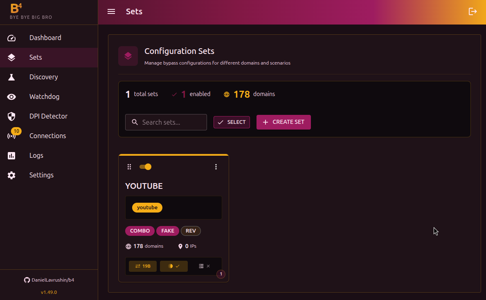
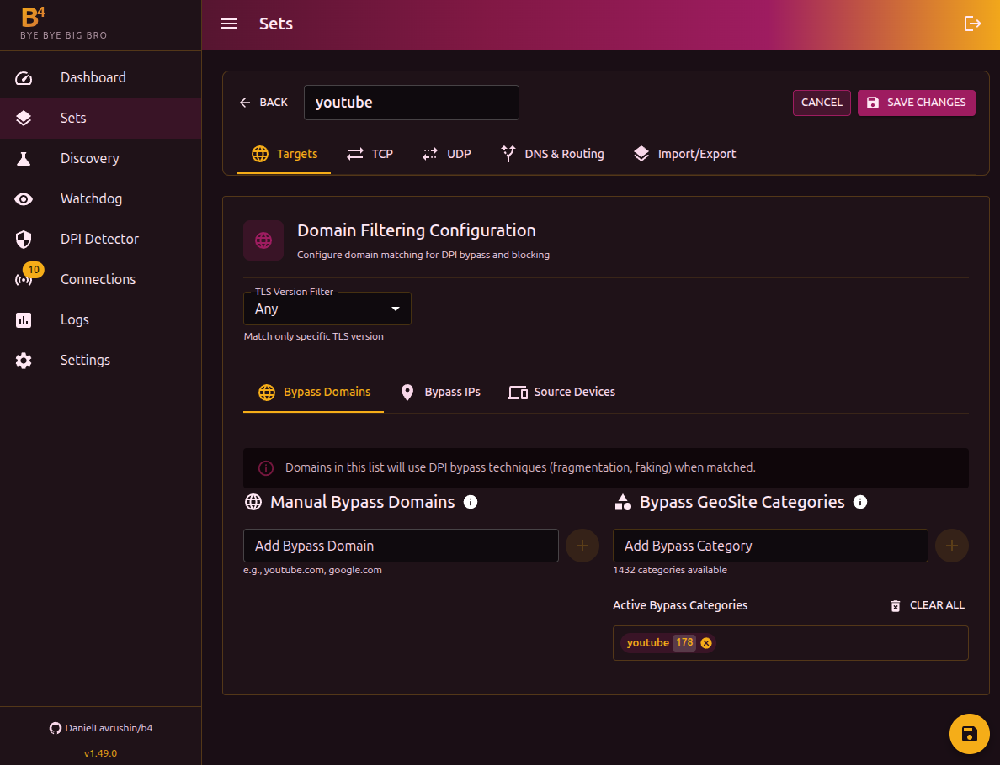
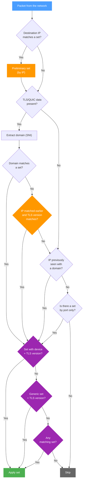

A set is a bundle of DPI bypass settings tied to a list of domains, IP addresses, UDP ports, or GeoSite/GeoIP categories. You can create multiple sets with different strategies for different sites.

## Managing sets

The **Sets** page shows every set you have created. For each set you see:

- Name and status (on/off)
- Number of domains and IPs
- Active techniques (COMBO, DISORDER, HYBRID, etc.)
- State of DNS routing and SNI Faking

Available actions:

- **Create set** - a new bundle of settings
- **Edit** - click the card
- **Duplicate** - create a copy of an existing set
- **Compare** - side-by-side comparison of two sets
- **Delete** - remove one or several sets (via bulk selection)
- **Drag and drop** - change the order of sets (order affects processing priority)

## Set editor

The editor has 5 tabs:

- [Targets](./targets) - domains, IPs, GeoSite/GeoIP categories, devices
- [TCP](./tcp/) - fragmentation, faking, desync, and other TCP strategies
- [UDP](./udp) - UDP traffic handling, QUIC, STUN
- [Routing](./routing) - DNS redirect and traffic routing through interfaces
- **Import/Export** - JSON representation of the set configuration for moving between devices

## How it works

### Match order

1. **IP address** - checked first. If the destination IP matches an IP/CIDR in some set, this is remembered as a preliminary match
2. **Domain (SNI)** - if the packet contains TLS/QUIC data, b4 extracts the domain. If the domain matches a set, **that set replaces** the preliminary IP match. Domain always has priority
3. **Learned IP** - if b4 has previously seen this IP tied to a domain (from earlier connections), the same set is used
4. **Port** - checked only if a set is configured by port only (no domains or IPs)
5. **Preliminary IP** - if neither domain, learned IP, nor port matched, the IP match from step 1 is used

:::tip Port filter
When a port filter is configured in a set, it acts as an additional condition. Even if the domain or IP matches, the packet is processed only when the port matches as well.
:::

:::info Picking a set when multiple match
If the same domain or IP is configured in multiple sets, b4 picks a set by priority:

1. A set with a defined **source device** matching the sender's MAC + matching **TLS version**
2. A set with no device binding + matching TLS version
3. If no set matches by TLS, the TLS version is ignored and the check is repeated

This way, device-bound sets always win over generic ones, and the TLS version filter narrows the choice without blocking processing.
:::

:::info Learned IPs
When b4 sees a connection where the domain (SNI) matches a set, it remembers the IP -> domain mapping for 10 minutes. This speeds up handling of later packets to the same server even when they do not carry SNI.
:::

### What happens on a match

For TCP packets, b4 intercepts the original packet and sends a modified version instead. Depending on the set settings, the following may be applied:

1. Removing the SACK option (if enabled)
2. ClientHello mutation (if enabled)
3. Desync (RST/FIN/ACK)
4. TCP window manipulation
5. Sending fake SNI packets
6. Fragmentation by the chosen strategy

For UDP, the packet is either dropped (drop mode) or replaced with a fake response (fake mode).

If no set matches, the packet passes through unchanged.

## Import and export

The **Import/Export** tab shows the JSON configuration of a set. You can:

- Copy the JSON to move it to another device
- Paste JSON to import a configuration

Source devices (MAC addresses) are not exported - they must be configured again on the target device.
