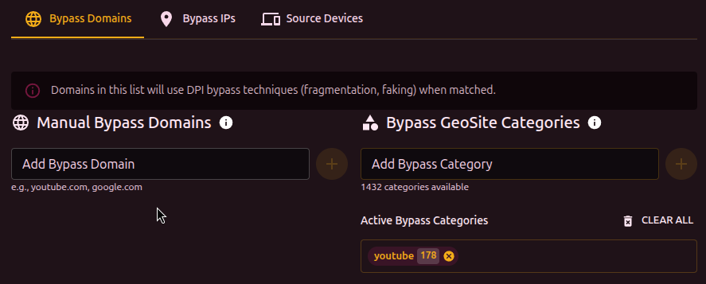
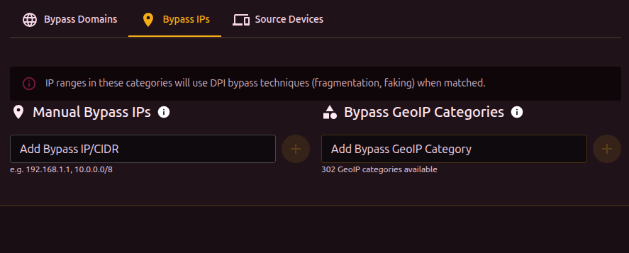
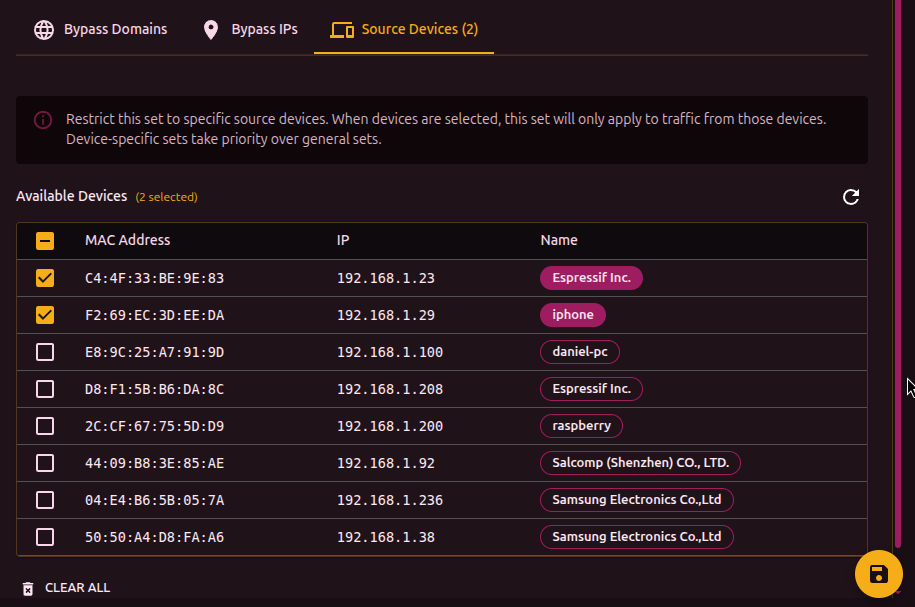

The "Targets" tab defines which traffic the set applies to. Traffic is filtered by domains, IP addresses, GeoSite/GeoIP categories, and source devices.

## TLS version filter

At the top of the tab is the TLS version selector:

- **Any** - process all TLS traffic
- **1.2** - only TLS 1.2
- **1.3** - only TLS 1.3

Useful when different TLS versions need different bypass strategies (some providers block TLS 1.2 and TLS 1.3 in different ways).

## Domains

Manual domain entry for bypass. Enter a domain and press Enter.

- Multiple domains can be added separated by commas or newlines
- Duplicates with another set trigger a warning
- The **Edit list** button opens a text editor (one domain per line)

## GeoSite categories

Instead of adding domains one by one, pick a category from the GeoSite database. Each category contains hundreds or thousands of domains (for example, `youtube`, `discord`, `google`).

To use GeoSite, the database must be loaded (Settings -> Geodat settings).

Clicking a category shows the list of domains it contains.

## IP addresses

Manual entry of IPs or CIDR ranges (for example, `10.0.0.0/8`, `192.168.1.100`).

Works the same way as domains: bulk editing supported, duplicates warned.

## GeoIP categories

The GeoIP equivalent for IP ranges. Categories are keyed to countries and ASNs.

## Source devices

Limits the set to traffic from specific devices on the network (by MAC address).

The table shows available devices:

| Column | Description |
| --- | --- |
| Select | Checkbox to include the device |
| MAC | Device MAC address |
| IP | Current IP address |
| Name | Device alias or vendor |

If no device is selected, the set applies to all traffic. When devices are selected, only their traffic is matched. Device-bound sets take priority over generic ones.
