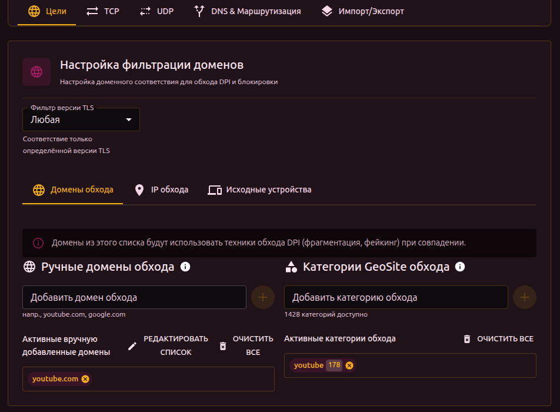

# Цели

Вкладка «Цели» определяет, к какому трафику применяется сет. Трафик фильтруется по доменам, IP-адресам, категориям GeoSite/GeoIP и исходным устройствам.

## Фильтр версии TLS

В верхней части вкладки — выбор версии TLS:

- **Any** — обрабатывать весь TLS-трафик
- **1.2** — только TLS 1.2
- **1.3** — только TLS 1.3

Это полезно, если для разных версий TLS нужны разные стратегии обхода (некоторые провайдеры блокируют TLS 1.2 и TLS 1.3 по-разному).

## Домены

Ручной ввод доменов для обхода. Введите домен и нажмите Enter.

- Можно добавлять несколько через запятую или перенос строки
- При дублировании с другим сетом — появляется предупреждение
- Кнопка **Редактировать список** открывает текстовый редактор (по одному домену на строку)

## Категории GeoSite

Вместо добавления доменов по одному можно выбрать категорию из базы GeoSite. Каждая категория содержит сотни или тысячи доменов (например, `youtube`, `discord`, `google`).

Для использования GeoSite нужно загрузить базу данных (Настройки → Geodat настройки).

Клик по категории показывает список входящих в неё доменов.

## IP-адреса

Ручной ввод IP или CIDR-диапазонов (например, `10.0.0.0/8`, `192.168.1.100`).

Работает аналогично доменам: поддержка массового редактирования, предупреждения о дублях.

## Категории GeoIP

Аналог GeoSite, но для IP-диапазонов. Категории привязаны к странам и ASN.

## Исходные устройства

Ограничивает действие сета трафиком от конкретных устройств в сети (по MAC-адресу).

Таблица показывает доступные устройства:

| Столбец | Описание |
| --- | --- |
| Выбор | Чекбокс для включения устройства |
| MAC | MAC-адрес устройства |
| IP | Текущий IP-адрес |
| Имя | Имя устройства или vendor |

Если устройства не выбраны — сет применяется ко всему трафику. Если выбраны — только к трафику от этих устройств. Сеты с привязкой к устройствам имеют приоритет над общими.
