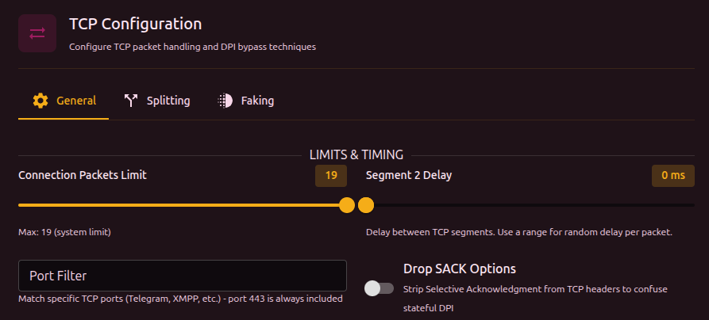
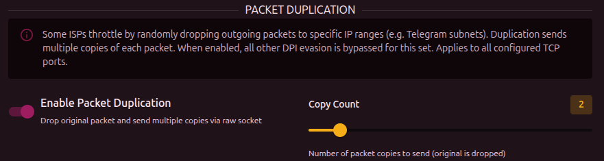

Basic parameters for processing TCP traffic in a set.

## TCP per-connection packet limit

How many packets at the start of each connection to analyze. After that limit, packets pass without modification. The TLS handshake (ClientHello) normally happens in the first 3-5 packets, so processing the whole connection is not needed.

:::info
This value cannot exceed the global limit in [Settings -> Core -> Queue](../../settings/core#queue-and-packet-processing). If a higher value is set here, the global limit is used instead.
:::

## Inter-packet delay (Seg2Delay)

Delay (ms) between sending fragments. Specified as a **min-max** range - each connection picks a random value from the range. When min and max are equal, the delay is fixed.

## Port filter

Limits the destination ports this set applies to. iptables-style format: `443` or `443,80`.

:::info
At the firewall level, b4 always intercepts port 443 traffic. Any extra ports listed in sets are added to the intercept. The port filter in a set narrows down what **this particular set** applies to, not what b4 processes globally.
:::

## Drop `SACK`

Removes the `Selective Acknowledgment` option from TCP packets. `SACK` helps the server and client retransmit lost fragments efficiently - some DPI systems use `SACK` to reassemble fragments in order.

## Packet duplication

Sends each packet several times (1-10 copies). Useful when the provider drops some packets on anomaly detection.

