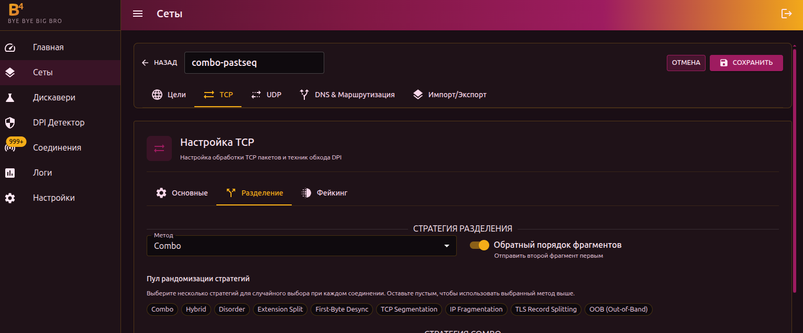

# Фрагментация

Основной инструмент обхода DPI. Суть: разбить TCP-пакет на части так, чтобы DPI не смог собрать их и прочитать содержимое (в частности, поле SNI в TLS ClientHello).



## Метод фрагментации

| Метод | Описание |
| --- | --- |
| **tcp** | Разделение на уровне TCP-сегментов. Один пакет становится двумя TCP-сегментами |
| **ip** | Разделение на уровне IP. Один IP-пакет разбивается на IP-фрагменты |
| **tls** | Одна TLS-запись разбивается на несколько TLS-записей внутри одного TCP-пакета |
| **oob** | Out-of-Band — вставка байта с TCP URG флагом, который сбивает DPI |
| **combo** | Комбинация нескольких точек разделения с приманками, перемешиванием и фейками между фрагментами |
| **hybrid** | Гибрид combo и disorder — комбинированные методы с изменённым порядком |
| **disorder** | Фрагменты отправляются не по порядку со случайными задержками |
| **extsplit** | Автоматическое разделение перед SNI-расширением в TLS ClientHello |
| **firstbyte** | Отправка одного байта, пауза, затем остальное — атака по таймингу |
| **none** | Без фрагментации (используйте, если нужен только faking) |

:::info Как выбрать метод
Используйте [Дискавери](../../discovery) — он протестирует все методы и найдёт рабочий. Ручной подбор нужен, если дискавери не справился или вы хотите оптимизировать конкретный случай.
:::

## Пул стратегий

Если включён пул, b4 случайным образом выбирает метод из пула для каждого нового соединения. Это затрудняет DPI адаптацию к конкретному методу — каждое соединение выглядит по-разному.

:::tip
Выберите несколько стратегий, которые работают у вашего провайдера (через дискавери), и включите их в пул. Пул не используется, если он пуст — в этом случае используется метод, выбранный выше.
:::

## Обратный порядок

Отправляет фрагменты в обратном порядке (последний фрагмент первым). DPI, ожидающий данные по порядку, не сможет собрать содержимое.

---

## TCP/IP Segmentation

Доступно при методе **tcp** или **ip**.

### Умное разделение SNI

Автоматически находит SNI-поле в TLS ClientHello и разделяет посередине имени хоста. Рекомендуемый вариант — не требует ручной настройки.

### Фиксированная позиция разделения

Ручное смещение точки разделения (0–50 байт от начала TLS payload). Используйте, если умное разделение не работает у вашего провайдера. Задаётся как диапазон **мин–макс** — для каждого соединения b4 выберет случайную позицию из диапазона.

:::info 3 сегмента
Если включены оба варианта (умное SNI + фиксированная позиция) — пакет разделяется на **3 сегмента**: на фиксированной позиции и в середине SNI.
:::

---

## Combo

Комбинирует несколько точек разделения с приманками и перемешиванием. Самый гибкий метод.

### Приманка (Decoy)

Отправляет фейковый ClientHello с разрешённым SNI перед реальным трафиком:

1. Фейковый пакет (с низким TTL) → DPI видит и анализирует, но пакет не доходит до сервера
2. Реальный пакет (фрагментированный) → проходит мимо DPI и доставляется серверу

### Точки разделения


| Параметр | Описание |
| --- | --- |
| First Byte | Разделение после первого байта (десинхронизация по времени) |
| Extension Split | Разделение перед SNI-расширением |
| SNI Split | Разделение в середине имени хоста SNI |

Каждая включённая точка добавляет дополнительный сегмент. Интерфейс показывает количество активных разделений и результирующее число сегментов.

:::warning
Должна быть включена хотя бы одна точка разделения, иначе combo отправит пакет одним сегментом.
:::

### Режим перемешивания

| Режим | Описание |
| --- | --- |
| `middle` | Первый и последний сегменты остаются на месте, перемешиваются только средние |
| `full` | Все сегменты случайно перемешиваются |
| `reverse` | Сегменты отправляются в обратном порядке |

### Тайминги


| Параметр | Описание | Диапазон |
| --- | --- | --- |
| Задержка первого сегмента | Пауза после отправки первого сегмента | 10–500 мс |
| Макс. джиттер | Случайная задержка между остальными сегментами | 100–10000 мкс |

### Фейк на сегмент (мультидисордер)

Отправляет фейковые перекрывающие пакеты перед **каждым** реальным сегментом, а не только перед первым. Засоряет реассемблер DPI мусором.

| Параметр | Описание | Диапазон |
| --- | --- | --- |
| Фейк на сегмент | Включить фейки между сегментами | — |
| Фейков на сегмент | Количество фейковых пакетов перед каждым сегментом | 1–11 |

---

## Disorder

Отправляет реальные TCP-сегменты не по порядку со случайными задержками. В отличие от combo, disorder не использует фейковые пакеты (кроме мультидисордера) — он полагается на то, что DPI ожидает последовательные данные.

### Режим перемешивания

| Режим | Описание |
| --- | --- |
| `full` | Все сегменты случайно перемешиваются |
| `reverse` | Сегменты отправляются в обратном порядке |

### Временной джиттер

Случайная задержка между сегментами. Задаётся как диапазон **мин–макс** (мкс).

:::info
Джиттер используется, когда Seg2Delay (задержка между пакетами на вкладке [Общее](./general)) равен 0. Если Seg2Delay задан — он имеет приоритет.
:::

:::warning
Максимальный джиттер должен быть больше минимального.
:::

### Перекрытие последовательности (seqovl)

Добавляет фейковые байты с уменьшённым TCP sequence number. DPI видит фейковый заголовок протокола, а сервер отбрасывает перекрытие (у него уже есть правильные данные).

| Паттерн | Что видит DPI |
| --- | --- |
| `tls12` | Заголовок TLS 1.2 |
| `tls11` | Заголовок TLS 1.1 |
| `tls10` | Заголовок TLS 1.0 |
| `http_get` | HTTP GET-запрос |
| `zeros` | Нулевые байты |
| `custom` | Свои hex-байты |

### Мультидисордер

Аналогично combo — отправляет фейковые перекрывающие пакеты перед каждым реальным сегментом.

---

## Extension Split

Автоматически разделяет TLS ClientHello прямо перед расширением SNI. DPI видит неполный список расширений и не может распарсить SNI.

```text
[TLS Header] [Handshake] [Ciphers] [Ext₁] [Ext₂] | [SNI: youtube.com] [Ext...]
                                                   ↑ разделение здесь
```

:::info Настройка не требуется
Extension Split работает автоматически. Используйте переключатель **Обратный порядок** и **Задержку между пакетами** (Seg2Delay) на вкладке [Общее](./general) для дополнительной настройки.
:::

---

## First-Byte Desync

Атака по таймингу: отправляет один байт (`0x16` — тип TLS-записи), делает паузу, затем отправляет остальной ClientHello. DPI видит неполную TLS-запись и не может распарсить SNI до истечения таймаута.

```text
[0x16] ──── пауза ──── [остальная часть TLS ClientHello...]
```

:::info Настройка не требуется
Задержка контролируется **Seg2Delay** на вкладке [Общее](./general). Минимум 100 мс применяется автоматически — если Seg2Delay меньше, b4 использует 100 мс.
:::

---

## OOB (Out-of-Band)

Вставляет байт с TCP URG (urgent) флагом в поток данных. Сервер игнорирует OOB-данные (они обрабатываются отдельно от основного потока), но DPI с отслеживанием состояния путается — видит лишний байт, который смещает его парсинг.

| Параметр | Описание | Диапазон |
| --- | --- | --- |
| Позиция вставки | Сколько байтов до точки вставки OOB. Задаётся как диапазон мин–макс | 1–50 |
| OOB байт | Байт, передаваемый через OOB (отображается символ + hex) | — |

---

## TLS Record Splitting

Разделяет ClientHello на несколько TLS-записей внутри одного TCP-пакета. DPI, ожидающий однозаписный хендшейк, не может сопоставить сигнатуру.

| Параметр | Описание | Диапазон |
| --- | --- | --- |
| Позиция разделения | Размер первой TLS-записи в байтах. Задаётся как диапазон мин–макс | 1–100 |
