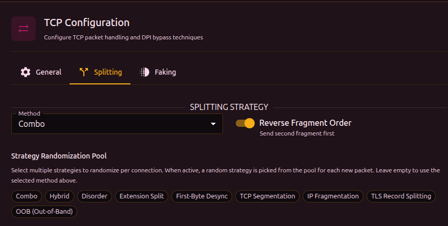
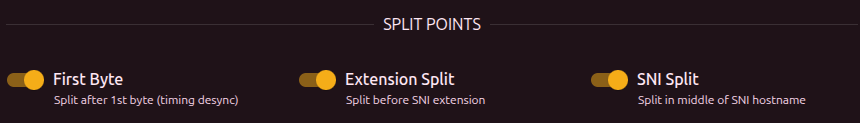
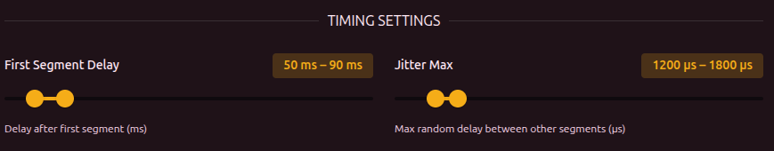

The primary DPI bypass tool. The idea: break a TCP packet into pieces so the DPI cannot reassemble them and read the contents (in particular, the SNI field in the TLS ClientHello).



## Splitting method

| Method | Description |
| --- | --- |
| **tcp** | Splitting at the TCP segment layer. One packet becomes two TCP segments |
| **ip** | Splitting at the IP layer. One IP packet is broken into IP fragments |
| **tls** | One TLS record is broken into several TLS records inside a single TCP packet |
| **oob** | Out-of-Band - inserts a byte with the TCP URG flag that throws off the DPI |
| **combo** | Combination of several split points with decoys, shuffling, and fakes between fragments |
| **hybrid** | Hybrid of combo and disorder - combined methods with reordered packets |
| **disorder** | Fragments are sent out of order with random delays |
| **extsplit** | Automatic splitting right before the SNI extension in the TLS ClientHello |
| **firstbyte** | Send a single byte, pause, then the rest - a timing attack |
| **none** | No splitting (use when only faking is needed) |

:::info How to pick a method
Use [Discovery](../../discovery) - it tests every method and finds one that works. Manual picking is for cases where discovery failed or you want to tune a specific case.
:::

## Strategy pool

When the pool is enabled, b4 picks a method at random from the pool for every new connection. This makes it harder for DPI to adapt to a specific method - each connection looks different.

:::tip
Pick a few strategies that work on your provider (via discovery) and include them in the pool. The pool is ignored when empty - in that case the method selected above is used.
:::

## Reverse order

Sends fragments in reverse order (last fragment first). A DPI that expects data in order cannot reassemble the content.

---

## TCP/IP Segmentation

Available for the **tcp** or **ip** method.

### Smart SNI splitting

Automatically finds the SNI field in the TLS ClientHello and splits in the middle of the hostname. Try this first - no manual tuning required.

### Fixed split position

Manual offset of the split point (0-50 bytes from the start of the TLS payload). Use this when smart splitting does not work on your provider. Specified as a **min-max** range - each connection picks a random position from the range.

:::info 3 segments
When both options (smart SNI + fixed position) are enabled, the packet is split into **3 segments**: at the fixed position and in the middle of the SNI.
:::

---

## Combo

Combines several split points with decoys and shuffling. The most flexible method.

### Decoy

Sends a fake ClientHello with an allowed SNI before the real traffic:

1. Fake packet (low TTL) -> DPI sees and analyzes it, but the packet does not reach the server
2. Real packet (fragmented) -> passes the DPI and is delivered to the server

### Split points



| Parameter | Description |
| --- | --- |
| First Byte | Split after the first byte (timing-based desync) |
| Extension Split | Split before the SNI extension |
| SNI Split | Split in the middle of the SNI hostname |

Each enabled split point adds another segment. The interface shows the number of active splits and the resulting number of segments.

:::warning
At least one split point must be enabled, otherwise combo sends the packet as a single segment.
:::

### Shuffle mode

| Mode | Description |
| --- | --- |
| `middle` | First and last segments keep their position, only the middle ones are shuffled |
| `full` | All segments are shuffled randomly |
| `reverse` | Segments are sent in reverse order |

### Timing



| Parameter | Description | Range |
| --- | --- | --- |
| First segment delay | Pause after sending the first segment | 10-500 ms |
| Max jitter | Random delay between the other segments | 100-10000 us |

### Fake per segment (multidisorder)

Sends fake overlapping packets before **every** real segment, not only the first. Fills the DPI reassembler with junk.

| Parameter | Description | Range |
| --- | --- | --- |
| Fake per segment | Send fakes between segments | - |
| Fakes per segment | Number of fake packets before each segment | 1-11 |

---

## Disorder

Sends real TCP segments out of order with random delays. Unlike combo, disorder does not use fake packets (except in multidisorder) - it relies on the DPI expecting sequential data.

### Disorder shuffle mode

| Mode | Description |
| --- | --- |
| `full` | All segments are shuffled randomly |
| `reverse` | Segments are sent in reverse order |

### Timing jitter

Random delay between segments. Specified as a **min-max** range (us).

:::info
Jitter is used when Seg2Delay (inter-packet delay on the [General](./general) tab) is 0. When Seg2Delay is set, it takes priority.
:::

:::warning
The maximum jitter must be greater than the minimum.
:::

### Sequence overlap (seqovl)

Adds fake bytes with a decreased TCP sequence number. The DPI sees a fake protocol header while the server discards the overlap (it already has the correct data).

| Pattern | What the DPI sees |
| --- | --- |
| `tls12` | TLS 1.2 header |
| `tls11` | TLS 1.1 header |
| `tls10` | TLS 1.0 header |
| `http_get` | HTTP GET request |
| `zeros` | Zero bytes |
| `custom` | Custom hex bytes |

### Multidisorder

Same as in combo - sends fake overlapping packets before each real segment.

---

## Extension Split

Automatically splits the TLS ClientHello right before the SNI extension. The DPI sees an incomplete extension list and cannot parse the SNI.

```text
[TLS Header] [Handshake] [Ciphers] [Ext1] [Ext2] | [SNI: youtube.com] [Ext...]
                                                   ^ split here
```

:::info No setup required
Extension Split works automatically. Use the **Reverse order** toggle and **Inter-packet delay** (Seg2Delay) on the [General](./general) tab for extra tuning.
:::

---

## First-Byte Desync

Timing attack: sends a single byte (`0x16` - the TLS record type), pauses, then sends the rest of the ClientHello. The DPI sees an incomplete TLS record and cannot parse the SNI before its timeout.

```text
[0x16] ---- pause ---- [rest of the TLS ClientHello...]
```

:::info No setup required
The delay is controlled by **Seg2Delay** on the [General](./general) tab. A minimum of 100 ms is applied automatically - if Seg2Delay is lower, b4 uses 100 ms.
:::

---

## OOB (Out-of-Band)

Injects a byte with the TCP URG (urgent) flag into the data stream. The server ignores OOB data (it is handled separately from the main stream), but a stateful DPI gets confused - it sees an extra byte that shifts its parsing.

| Parameter | Description | Range |
| --- | --- | --- |
| Insert position | Number of bytes before the OOB insertion point. Specified as a min-max range | 1-50 |
| OOB byte | Byte sent via OOB (symbol + hex are shown) | - |

---

## TLS Record Splitting

Splits the ClientHello into several TLS records inside a single TCP packet. A DPI that expects a single-record handshake cannot match its signature.

| Parameter | Description | Range |
| --- | --- | --- |
| Split position | Size of the first TLS record in bytes. Specified as a min-max range | 1-100 |
