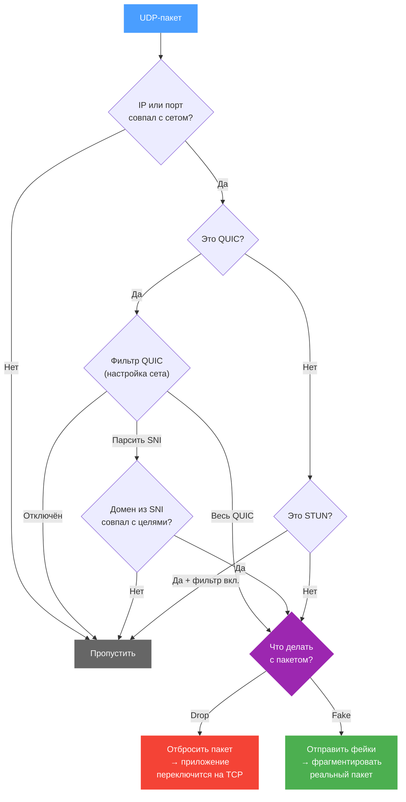

# UDP

Вкладка UDP управляет обработкой UDP-трафика. Два основных сценария:

1. **Блокировка QUIC** — браузер переключается на TCP, где b4 применяет обход DPI
2. **Обход DPI для UDP** — фейковые пакеты и фрагментация для UDP-трафика

<!-- screenshot: вкладка UDP -->

## Как b4 обрабатывает UDP

## Какой UDP-трафик обрабатывать

Чтобы b4 начал обрабатывать UDP, должен быть включён хотя бы один из фильтров: QUIC или порты. Без них все UDP-пакеты проходят без изменений.

### Фильтр QUIC

QUIC — протокол поверх UDP, который используют браузеры (YouTube, Google, Discord и др.). Шифрование QUIC отличается от TCP/TLS, поэтому стратегии обхода TCP к нему неприменимы.

| Режим | Описание |
| --- | --- |
| **Отключён** | QUIC-трафик не обрабатывается |
| **Весь QUIC** | Совпадение со всеми QUIC Initial пакетами. Не анализирует содержимое — просто определяет, что пакет является QUIC |
| **Парсить SNI** | Извлекает домен (SNI) из QUIC ClientHello и обрабатывает только пакеты, домен которых совпадает с целями сета |

:::warning Парсинг SNI требует домены
В режиме **Парсить SNI** необходимо добавить домены в разделе [Цели](./targets). Без доменов QUIC-трафик обрабатываться не будет.
:::

:::tip Когда использовать «Весь QUIC»
Если цель — заставить браузер переключиться на TCP (где b4 работает эффективнее), используйте **Весь QUIC** в режиме **Drop**. Браузер автоматически перейдёт на HTTPS/TCP после нескольких неудачных попыток QUIC.
:::

### Фильтр портов

Совпадение с определёнными UDP-портами — для обработки трафика VoIP, игр и других UDP-приложений. Формат: `5000-6000,8000`. Оставьте пустым для отключения.

### Фильтровать STUN-пакеты

Игнорировать STUN-пакеты — они проходят без обработки. STUN используется для NAT traversal в WebRTC (голосовые/видеозвонки).

:::info
Рекомендуется включить, если вы используете голосовые или видеозвонки (Discord, Telegram, WhatsApp). Блокировка STUN нарушит их работу.
:::

---

## Как обрабатывать совпавший трафик

Настройки ниже доступны, если включён хотя бы один фильтр (QUIC или порты).

### Лимит пакетов соединения

Максимальное количество пакетов в начале UDP-соединения, которые анализируются. Не может превышать глобальный лимит из [Настройки → Основные → Очередь](../settings/core#очередь-и-обработка-пакетов).

### Режим действия

| Режим | Описание |
| --- | --- |
| **Drop** | Отбрасывает совпавшие UDP-пакеты. Приложение вынуждено переключиться на TCP (например, QUIC → HTTPS) |
| **Fake & Fragment** | Отправляет фейковые пакеты перед реальными и фрагментирует реальные для обхода DPI |

---

## Настройки Fake & Fragment

Доступны при режиме **Fake & Fragment**.

### Стратегия фейка

Определяет, как фейковый пакет станет необрабатываемым для сервера:

| Стратегия | Описание |
| --- | --- |
| **Нет** | Без стратегии — фейковые пакеты отправляются как есть |
| **TTL** | Низкий TTL — фейковые пакеты истекают на промежуточном узле и не доходят до сервера |
| **Checksum** | Повреждённая контрольная сумма UDP — сервер отбрасывает пакеты с неверной суммой |

### Параметры

| Параметр | Описание | Диапазон |
| --- | --- | --- |
| Количество фейковых пакетов | Сколько фейковых пакетов отправить перед реальным | 1–20 |
| Размер фейкового пакета | Размер payload каждого фейкового UDP-пакета в байтах | 32–1500 |
| Задержка между сегментами | Задержка между отправкой фейковых и реальных пакетов. Задаётся как диапазон мин–макс — для каждого соединения выбирается случайное значение | 0–1000 мс |
