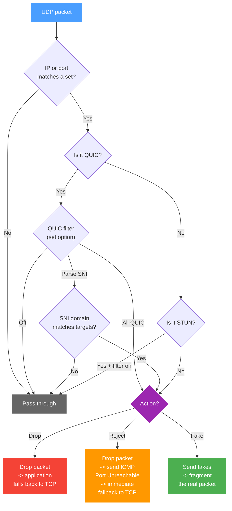

The UDP tab controls UDP traffic handling. Two main scenarios:

1. **Block QUIC** - the browser falls back to TCP, where b4 applies DPI bypass
2. **DPI bypass for UDP** - fake packets and fragmentation for UDP traffic

## How b4 handles UDP

## Which UDP traffic to process

For b4 to process UDP at all, at least one filter must be enabled: QUIC or ports. Without either, all UDP packets pass through unchanged.

### QUIC filter

QUIC is a protocol over UDP used by browsers (YouTube, Google, Discord, etc.). QUIC encryption differs from TCP/TLS, so TCP bypass strategies do not apply to it.

| Mode | Description |
| --- | --- |
| **Off** | QUIC traffic is not processed |
| **All QUIC** | Matches every QUIC Initial packet. Does not inspect contents - simply detects that the packet is QUIC |
| **Parse SNI** | Extracts the domain (SNI) from the QUIC ClientHello and processes only packets whose domain matches the set targets |

:::warning Parse SNI requires domains
In **Parse SNI** mode you must add domains in the [Targets](./targets) section. Without domains, QUIC traffic is not processed.
:::

:::tip When to use "All QUIC"
When the goal is to force the browser to fall back to TCP (where b4 is more effective), use **All QUIC** in **Reject** mode. The browser switches to HTTPS/TCP immediately after getting the ICMP unreachable response.
:::

### Port filter

Match specific UDP ports - useful for VoIP, games, and other UDP applications. Format: `5000-6000,8000`. Leave empty to disable.

### Filter STUN packets

Ignore STUN packets - they pass through without processing. STUN is used for NAT traversal in WebRTC (voice and video calls).

:::info
Enable this when you use voice or video calls (Discord, Telegram, WhatsApp). Blocking STUN breaks them.
:::

---

## How to handle matched traffic

The settings below are available when at least one filter (QUIC or ports) is enabled.

### Per-connection packet limit

Maximum number of packets at the start of a UDP connection that get analyzed. Cannot exceed the global limit in [Settings -> Core -> Queue](../settings/core#queue-and-packet-processing).

### Action mode

| Mode | Description |
| --- | --- |
| **Drop** | Drops matched UDP packets. The application is forced to fall back to TCP (for example, QUIC -> HTTPS) |
| **Reject** | Drops the packet and sends ICMP Port Unreachable to the client. The client immediately learns UDP is unavailable and switches to TCP without waiting for a timeout |
| **Fake & Fragment** | Sends fake packets before the real ones and fragments the real packets to bypass DPI |

:::tip Drop vs Reject
**Drop** - the client waits for a timeout (usually 3-10 seconds) before falling back to TCP. **Reject** - the client gets an ICMP response and switches to TCP almost instantly.
:::

---

## Fake & Fragment settings

Available in **Fake & Fragment** mode.

### Fake strategy

How the fake packet becomes unprocessable to the server:

| Strategy | Description |
| --- | --- |
| **None** | No strategy - fake packets are sent as-is |
| **TTL** | Low TTL - fake packets expire on an intermediate hop and never reach the server |
| **Checksum** | Broken UDP checksum - the server drops packets with an invalid checksum |

### Parameters

| Parameter | Description | Range |
| --- | --- | --- |
| Fake packet count | How many fake packets to send before the real one | 1-20 |
| Fake packet size | Payload size of each fake UDP packet in bytes | 32-1500 |
| Segment delay | Delay between sending fakes and real packets. Specified as a min-max range - each connection picks a random value from the range | 0-1000 ms |
