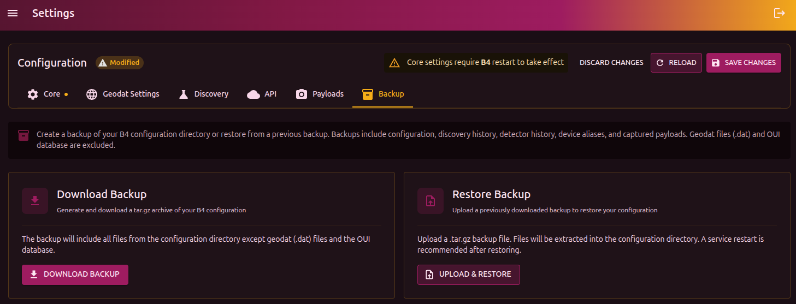

## Download a backup

The **Download** button creates a `.tar.gz` archive with the full b4 configuration. The archive contains the contents of the configuration directory, except for `.dat` files (GeoSite/GeoIP) and the OUI database (vendor lookup).

## Restore from a backup

1. Click **Upload** and select a previously downloaded `.tar.gz`
2. The configuration files will be replaced with the contents of the archive
3. After restore, you will be prompted to restart the service

:::warning
Restore fully replaces the current configuration. If you need to keep the current settings, download a backup first.
:::
