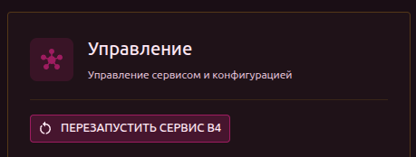
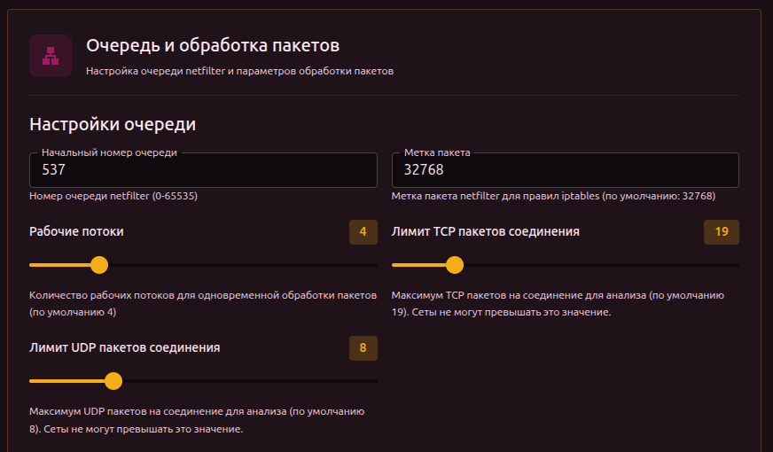
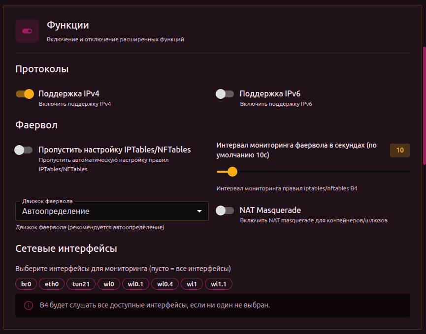
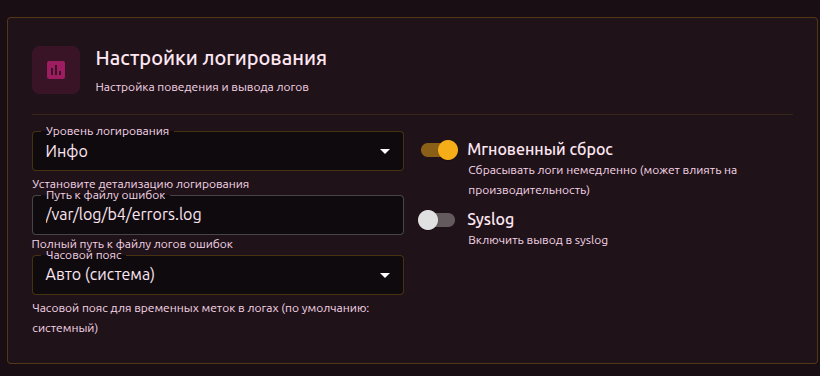
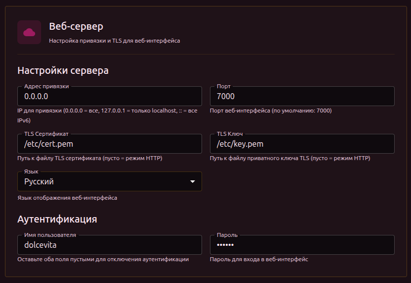
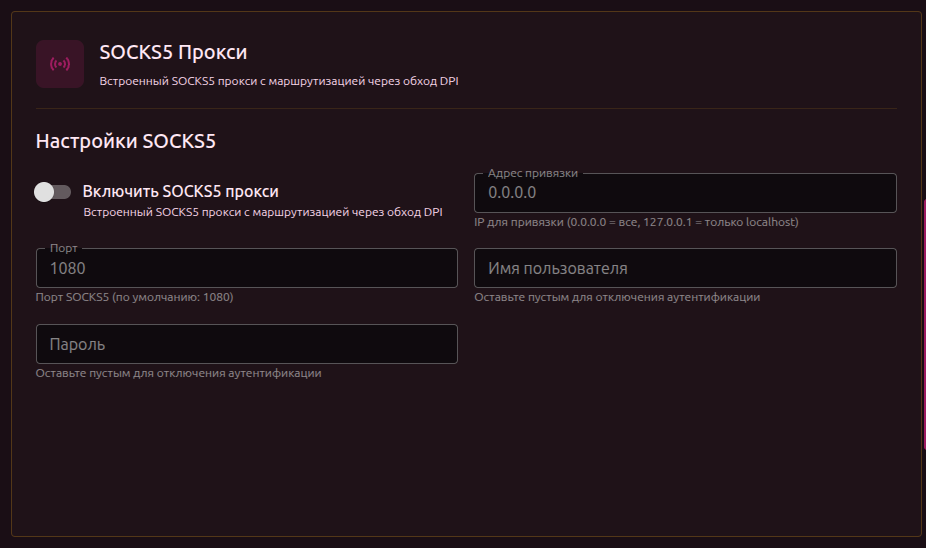
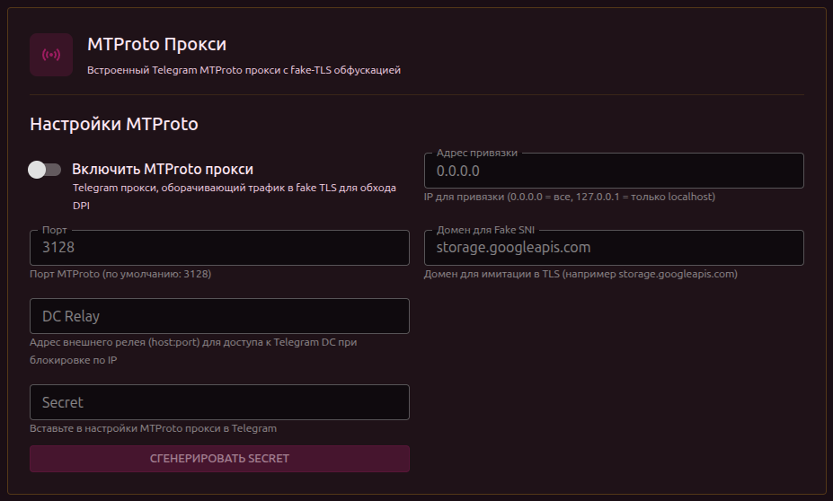
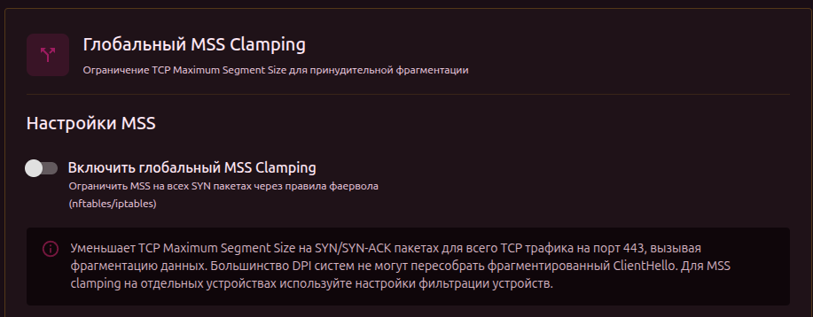
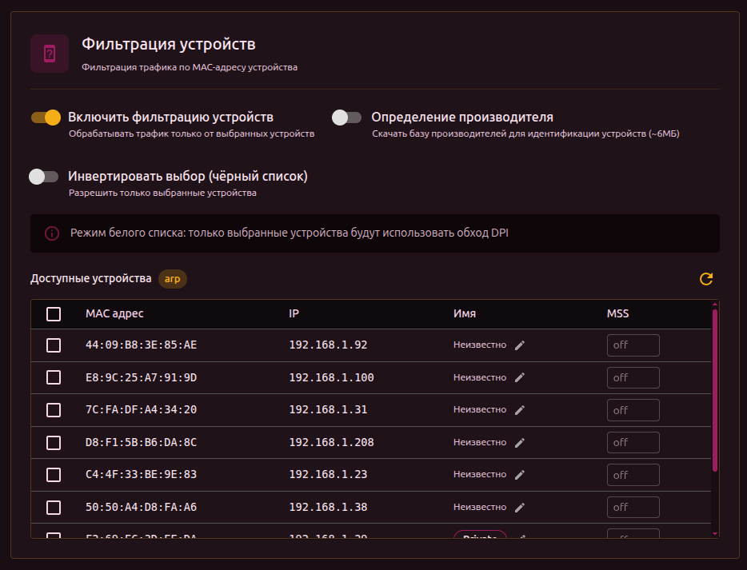

# Основные настройки

Все изменения на этой вкладке требуют перезапуска сервиса (кроме языка интерфейса).

## Управление

Кнопки в верхней части настроек:

- **Перезапустить сервис** — перезапуск b4 (ожидаемое время простоя: 5–10 секунд)

:::warning Сброс конфигурации
При сбросе конфигурации сохраняются: домены, категории GeoSite/GeoIP и настройки тестирования. Всё остальное (сеть, обход DPI, протоколы, логирование) сбрасывается.
:::

## Очередь и обработка пакетов

Настройки ядра обработки пакетов через netfilter.

| Параметр | Описание | Диапазон | По умолчанию |
| --- | --- | --- | --- |
| Начальный номер очереди | Номер NFQUEUE. Изменяйте, если другие программы используют те же номера | 0–65535 | `537` |
| Метка пакета | Метка netfilter для правил iptables/nftables. b4 использует её для маркировки обработанных пакетов | — | `32768` |
| Рабочие потоки | Количество параллельных воркеров. Больше потоков = выше пропускная способность на многоядерных системах | 1–16 | `4` |
| Лимит TCP пакетов соединения | Сколько TCP-пакетов на соединение анализировать. Сеты не могут превышать это значение | 1–100 | `19` |
| Лимит UDP пакетов соединения | Сколько UDP-пакетов на соединение анализировать. Сеты не могут превышать это значение | 1–30 | `8` |

:::tip Лимиты пакетов
Эти лимиты — глобальный потолок. В каждом сете можно установить свой лимит, но он не может быть выше глобального. Увеличение значения даёт b4 больше времени на анализ, но повышает нагрузку.
:::

## Функции

### Протоколы

| Параметр | Описание | По умолчанию |
| --- | --- | --- |
| Поддержка IPv4 | Обработка IPv4-трафика | Вкл |
| Поддержка IPv6 | Обработка IPv6-трафика | Выкл |

### Фаервол

| Параметр | Описание | По умолчанию |
| --- | --- | --- |
| Пропустить настройку IPTables/NFTables | b4 не будет создавать правила firewall. Используйте, если настраиваете правила вручную | Выкл |
| Интервал мониторинга фаервола | Как часто проверять и восстанавливать правила (сек). Если правила удаляются внешними программами, b4 восстановит их | `10` |
| Движок фаервола | Какой backend использовать для правил | Автоопределение |
| NAT Masquerade | Включить NAT-маскарад. Нужен для контейнеров и шлюзов, где b4 перенаправляет трафик | Выкл |
| Интерфейс Masquerade | На каком интерфейсе применять маскарад. Появляется при включении NAT Masquerade | Все |

:::warning Интервал мониторинга
Значение 0 полностью отключает мониторинг правил. Если внешняя программа или скрипт удалит правила b4 — они не будут восстановлены.
:::

Движок фаервола — выбор из:

| Значение | Описание |
| --- | --- |
| Автоопределение | b4 сам определит доступный backend (рекомендуется) |
| nftables | Использовать nftables |
| iptables | Использовать iptables |
| iptables-legacy | Использовать iptables-legacy (для старых систем) |

### Сетевые интерфейсы

Выбор интерфейсов для мониторинга. Интерфейсы отображаются как кликабельные метки — нажмите, чтобы включить/выключить.

:::info
Если не выбран ни один интерфейс — b4 слушает все доступные.
:::

## Настройки логирования

| Параметр | Описание | По умолчанию |
| --- | --- | --- |
| Уровень логирования | Детализация логов | INFO |
| Путь к файлу ошибок | Записывать ошибки в файл | `/var/log/b4/errors.log` |
| Часовой пояс | Часовой пояс для временных меток | Системный (авто) |
| Мгновенный сброс | Сбрасывать буфер после каждой записи. Может влиять на производительность | Вкл |
| Syslog | Дублировать логи в системный syslog | Выкл |

Уровни логирования:

| Уровень | Что отображается |
| --- | --- |
| Ошибка | Только ошибки |
| Инфо | Ошибки + основные события |
| Трассировка | Инфо + детали обработки пакетов |
| Отладка | Всё, включая отладочную информацию |

:::warning Уровень Ошибка
При уровне **Ошибка** разделы **Логи** и **Соединения** в веб-интерфейсе не будут показывать данные — они получают информацию из потока логов, который при этом уровне практически пуст.
:::

:::info Файл ошибок
b4 не ведёт постоянный лог-файл — всё выводится в stdout/stderr (и перехватывается веб-интерфейсом через WebSocket). В файл `errors.log` записываются только критические ошибки и аварийные завершения.
:::

:::tip
Для диагностики проблем используйте **Трассировка** или **Отладка**. Для обычной работы достаточно **Инфо**.
:::

## Веб-сервер

Настройки веб-интерфейса b4.

| Параметр | Описание | По умолчанию |
| --- | --- | --- |
| Адрес привязки | IP для прослушивания. `0.0.0.0` = все интерфейсы, `127.0.0.1` = только localhost, `::` = все IPv6 | `0.0.0.0` |
| Порт | Порт веб-интерфейса | `7000` |
| TLS Сертификат | Путь к файлу сертификата `.crt` или `.pem` (пусто = HTTP) | — |
| TLS Ключ | Путь к файлу ключа `.key` или `.pem` (пусто = HTTP) | — |
| Язык | Язык интерфейса: English / Русский | English |

### Авторизация

| Параметр | Описание | По умолчанию |
| --- | --- | --- |
| Имя пользователя | Логин для входа в веб-интерфейс | — |
| Пароль | Пароль для входа | — |

:::warning Частичная авторизация
Авторизация работает только когда заполнены **оба** поля. Если указано только имя пользователя или только пароль — авторизация не включится.
:::

:::warning HTTP + авторизация
Если авторизация включена, но TLS не настроен — логин и пароль передаются по незашифрованному HTTP. Настройте TLS-сертификаты для безопасной передачи. Подробнее — в разделе [Безопасность](./security).
:::

## SOCKS5 Прокси

Встроенный SOCKS5-прокси. Приложения могут направлять через него трафик — он будет обработан b4 с применением настроенных сетов.

| Параметр | Описание | По умолчанию |
| --- | --- | --- |
| Включить | Запустить SOCKS5-сервер | Выкл |
| Адрес привязки | IP для прослушивания. `0.0.0.0` = все, `127.0.0.1` = только localhost | `0.0.0.0` |
| Порт | Порт прокси | `1080` |
| Имя пользователя | Логин для SOCKS5-авторизации (пусто = без авторизации) | — |
| Пароль | Пароль для SOCKS5-авторизации (пусто = без авторизации) | — |

Все поля кроме «Включить» становятся доступны только после включения прокси.

:::info
Изменения настроек SOCKS5 требуют перезапуска сервиса.
:::

## MTProto Прокси

Встроенный Telegram MTProto-прокси с fake-TLS обфускацией. Трафик Telegram оборачивается в TLS-соединение, маскируясь под обычный HTTPS-трафик. Подробное руководство по настройке — в разделе [MTProto Прокси](../mtproto).

| Параметр | Описание | По умолчанию |
| --- | --- | --- |
| Включить | Запустить MTProto-сервер | Выкл |
| Адрес привязки | IP для прослушивания | `0.0.0.0` |
| Порт | Порт прокси | `3128` |
| Домен для Fake SNI | Домен, который будет виден в TLS-рукопожатии. DPI увидит этот домен вместо Telegram | `storage.googleapis.com` |
| DC Relay | Адрес внешнего relay-сервера (host:port) для доступа к Telegram DC, если они заблокированы по IP | — |
| Secret | Секрет для подключения клиента Telegram. Вставьте его в настройках прокси в Telegram | — |

Кнопка **Сгенерировать Secret** создаёт секрет на основе текущего домена Fake SNI.

:::info DC Relay
DC Relay нужен, когда b4 установлен на роутере внутри страны с блокировкой, а IP-адреса серверов Telegram заблокированы. В этом случае нужен VPS за пределами блокировки, который будет relay-сервером.
:::

:::info
Изменения настроек MTProto требуют перезапуска сервиса.
:::

## Глобальный MSS Clamping

Ограничение TCP Maximum Segment Size на SYN/SYN-ACK пакетах для трафика на порт 443. Уменьшает размер сегментов, что приводит к естественной фрагментации — DPI не может собрать фрагментированный ClientHello.

| Параметр | Описание | Диапазон | По умолчанию |
| --- | --- | --- | --- |
| Включить | Активировать глобальный MSS Clamping | — | Выкл |
| Размер MSS | Размер MSS в байтах. Меньше значение = больше фрагментация | 10–1460 | `88` |

:::info Глобальный vs индивидуальный MSS
Глобальный MSS Clamping применяется ко **всему** трафику на порт 443. Если нужно ограничить MSS только для конкретных устройств (например, телевизор с YouTube) — настройте MSS в столбце **MSS** в [таблице устройств](#фильтрация-устройств) ниже. Индивидуальный MSS работает независимо от глобального.
:::

## Фильтрация устройств

Ограничение работы b4 трафиком от конкретных устройств в сети (по MAC-адресу). Полезно, если обход нужен не для всех устройств.

| Параметр | Описание | По умолчанию |
| --- | --- | --- |
| Включить | Активировать фильтрацию по устройствам | Выкл |
| Определение производителя | Скачать базу vendor для определения производителя по MAC (~6 МБ) | Выкл |
| Инвертировать выбор | Переключение между белым и чёрным списком | Выкл |

:::info Режимы фильтрации

- **Белый список** (по умолчанию) — обход DPI работает **только** для выбранных устройств
- **Чёрный список** (инвертировать выбор) — выбранные устройства **исключаются** из обхода DPI

:::

### Таблица устройств

При включении фильтрации появляется таблица обнаруженных устройств:

| Столбец | Описание |
| --- | --- |
| Выбор | Чекбокс для включения/исключения устройства |
| MAC | MAC-адрес |
| IP | Текущий IP-адрес |
| Имя | Псевдоним устройства (можно задать через иконку редактирования) или vendor |
| MSS | Индивидуальный MSS Clamping для этого устройства (10–1460, пусто = выключен) |

Кнопка **Обновить** перезагружает список устройств из ARP-таблицы.

:::tip Индивидуальный MSS
MSS Clamping можно настроить для каждого устройства отдельно — например, уменьшить MSS только для телевизора с YouTube, не затрагивая остальные устройства.
:::
