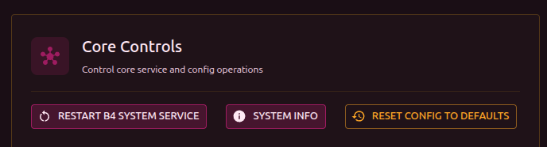
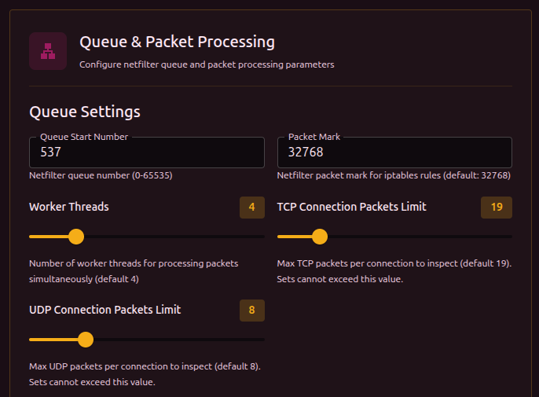
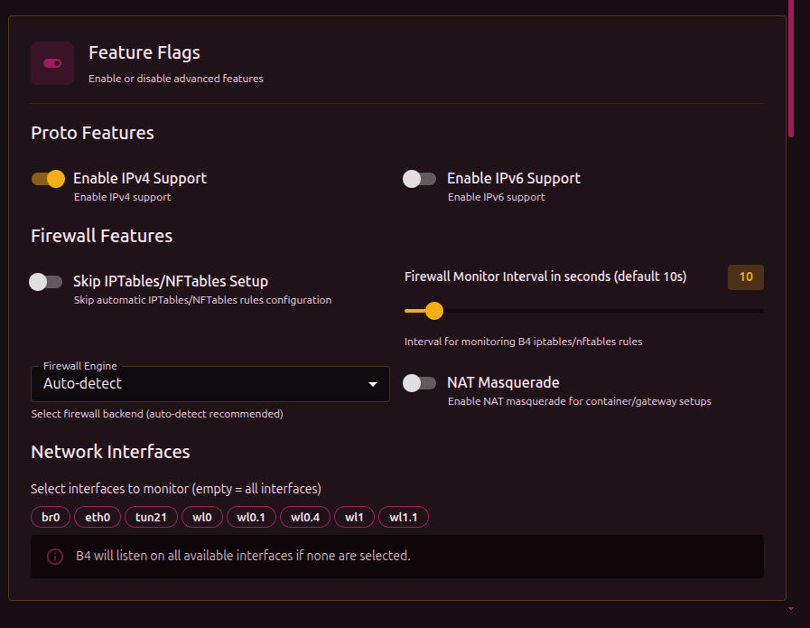
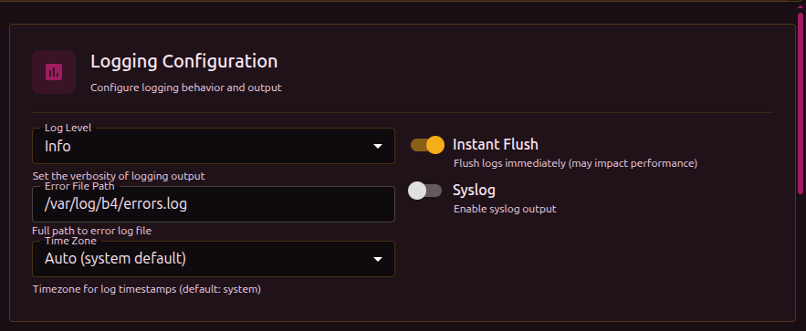
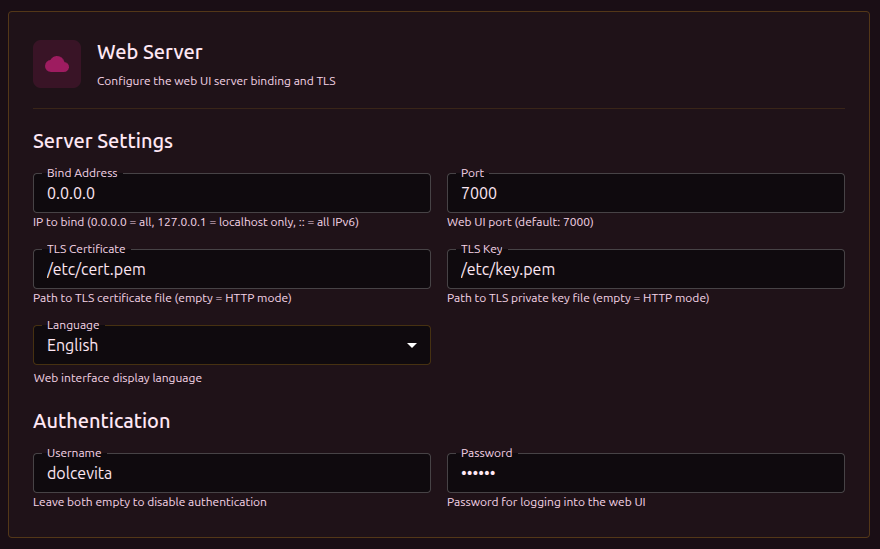
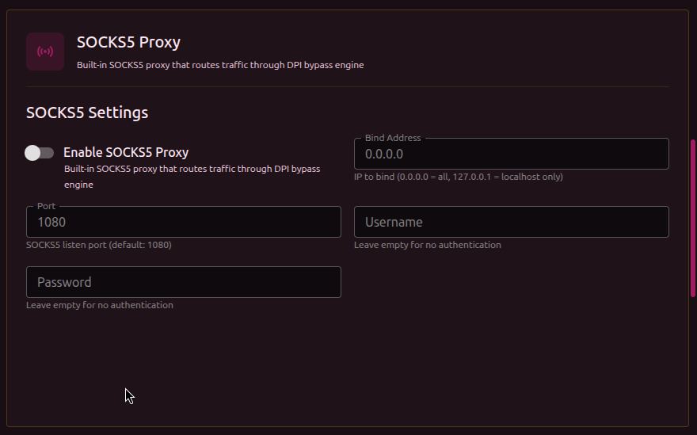
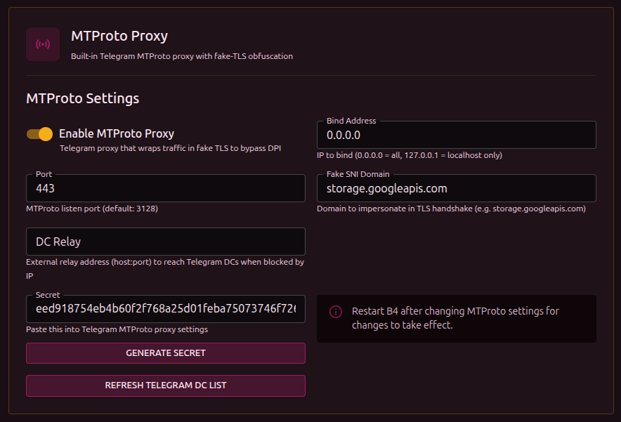
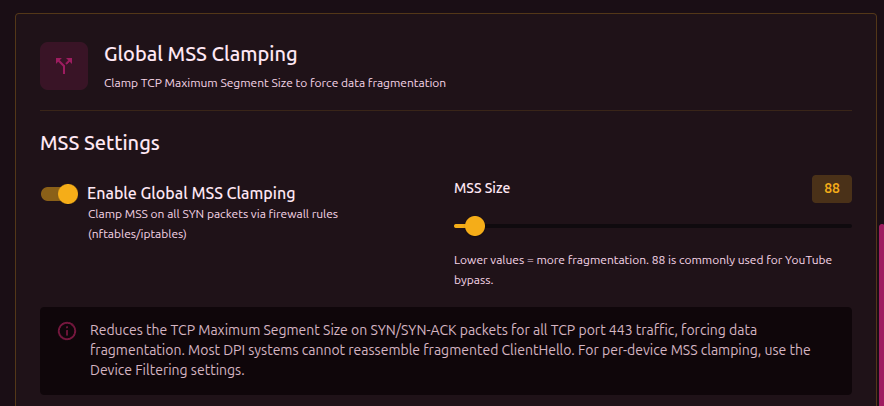
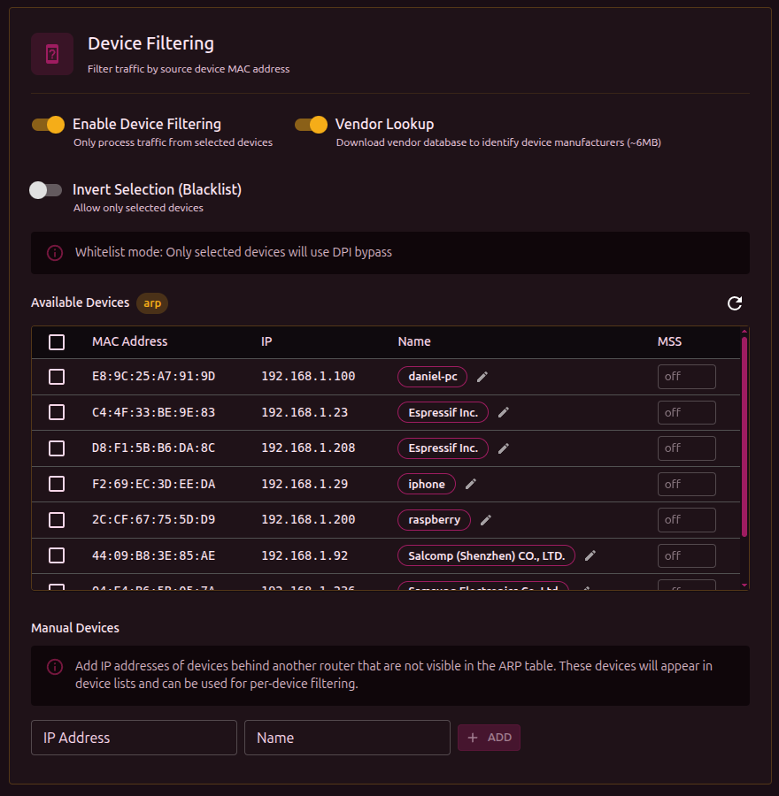

All changes on this tab require a service restart (except the interface language).

## Controls

Buttons at the top of the settings:

- **Restart service** - restart b4 (expected downtime: 5-10 seconds)

:::warning Reset configuration
When the configuration is reset, these are preserved: domains, GeoSite/GeoIP categories, and test settings. Everything else (network, DPI bypass, protocols, logging) is reset to defaults.
:::

## Queue and packet processing

Settings for the packet processing core over netfilter.

| Parameter | Description | Range | Default |
| --- | --- | --- | --- |
| Starting queue number | NFQUEUE number. Change if other programs use the same numbers | 0-65535 | `537` |
| Packet mark | netfilter mark for iptables/nftables rules. b4 uses it to mark processed packets | - | `32768` |
| Worker threads | Number of parallel workers. More threads = higher throughput on multi-core systems | 1-16 | `4` |
| TCP per-connection packet limit | How many TCP packets per connection to analyze. Sets cannot exceed this value | 1-100 | `19` |
| UDP per-connection packet limit | How many UDP packets per connection to analyze. Sets cannot exceed this value | 1-30 | `8` |

:::tip Packet limits
These limits are a global ceiling. Each set can define its own limit, but not above the global one. A higher value gives b4 more time to analyze but increases load.
:::

## Features

### Protocols

| Parameter | Description | Default |
| --- | --- | --- |
| IPv4 support | Process IPv4 traffic | On |
| IPv6 support | Process IPv6 traffic | Off |

### Firewall

| Parameter | Description | Default |
| --- | --- | --- |
| Skip IPTables/NFTables setup | b4 will not create firewall rules. Use this if you manage rules manually | Off |
| Firewall monitor interval | How often to check and restore rules (seconds). If external programs delete rules, b4 will restore them | `10` |
| Firewall engine | Which backend to use for rules | Auto-detect |
| NAT Masquerade | Enable NAT masquerading. Needed for containers and gateways where b4 forwards traffic | Off |
| Masquerade interface | Interface to apply masquerading on. Appears when NAT Masquerade is enabled | All |

:::warning Monitor interval
Setting this to 0 turns off rule monitoring completely. If an external program or script removes b4's rules, they will not be restored.
:::

Firewall engine options:

| Value | Description |
| --- | --- |
| Auto-detect | b4 picks the available backend (recommended) |
| nftables | Use nftables |
| iptables | Use iptables |
| iptables-legacy | Use iptables-legacy (for older systems) |

### Network interfaces

Pick interfaces to monitor. Interfaces are shown as clickable tags - click to enable/disable.

:::info
If no interface is selected, b4 listens on every available one.
:::

## Logging

| Parameter | Description | Default |
| --- | --- | --- |
| Log level | Log verbosity | INFO |
| Error file path | File to write errors to | `/var/log/b4/errors.log` |
| Timezone | Timezone for timestamps | System (auto) |
| Immediate flush | Flush the buffer after every write. May affect performance | On |
| Syslog | Also send logs to the system syslog | Off |

Log levels:

| Level | What is shown |
| --- | --- |
| Error | Only errors |
| Info | Errors + main events |
| Trace | Info + packet processing details |
| Debug | Everything, including debug info |

:::warning Error level
At the **Error** level, the **Logs** and **Connections** sections in the web interface will not show data - they read from the log stream, which is almost empty at this level.
:::

:::info Error file
b4 does not keep a persistent log file - everything goes to stdout/stderr (and is captured by the web interface through a WebSocket). Only critical errors and crashes are written to `errors.log`.
:::

:::tip
For diagnosing issues use **Trace** or **Debug**. For normal operation **Info** is enough.
:::

## Web server

Settings for the b4 web interface.

| Parameter | Description | Default |
| --- | --- | --- |
| Bind address | IP to listen on. `0.0.0.0` = all interfaces, `127.0.0.1` = localhost only, `::` = all IPv6 | `0.0.0.0` |
| Port | Web interface port | `7000` |
| TLS Certificate | Path to a `.crt` or `.pem` certificate file (empty = HTTP) | - |
| TLS Key | Path to a `.key` or `.pem` key file (empty = HTTP) | - |
| Language | Interface language: English / Русский | English |

### Authentication

| Parameter | Description | Default |
| --- | --- | --- |
| Username | Login for the web interface | - |
| Password | Password | - |

:::warning Partial authentication
Authentication only applies when **both** fields are filled. If only the username or only the password is set, authentication stays off.
:::

:::warning HTTP + authentication
If authentication is enabled but TLS is not configured, the username and password travel over unencrypted HTTP. Configure TLS certificates for secure transport. See the [Security](./security) section.
:::

## SOCKS5 proxy

A built-in SOCKS5 proxy. Applications can route traffic through it - it is processed by b4 with the configured sets applied.

| Parameter | Description | Default |
| --- | --- | --- |
| Enable | Start the SOCKS5 server | Off |
| Bind address | IP to listen on. `0.0.0.0` = all, `127.0.0.1` = localhost only | `0.0.0.0` |
| Port | Proxy port | `1080` |
| Username | Login for SOCKS5 authentication (empty = no authentication) | - |
| Password | Password for SOCKS5 authentication (empty = no authentication) | - |

Every field except "Enable" becomes available only after the proxy is enabled.

:::info
Changes to SOCKS5 settings require a service restart.
:::

## MTProto proxy

A built-in Telegram MTProto proxy with fake-TLS obfuscation. Telegram traffic is wrapped in a TLS connection, masquerading as regular HTTPS. Detailed setup in the [MTProto Proxy](../mtproto) section.

| Parameter | Description | Default |
| --- | --- | --- |
| Enable | Start the MTProto server | Off |
| Bind address | IP to listen on | `0.0.0.0` |
| Port | Proxy port | `3128` |
| Fake SNI domain | The domain visible in the TLS handshake. The DPI sees this domain instead of Telegram | `storage.googleapis.com` |
| DC Relay | External relay address (host:port) for reaching Telegram DCs when they are IP-blocked | - |
| Secret | Secret for the Telegram client to connect. Paste it into the Telegram proxy settings | - |

The **Generate Secret** button creates a secret based on the current Fake SNI domain.

:::info DC Relay
DC Relay is needed when b4 is installed on a router inside a country with blocking, and Telegram server IPs are blocked. A VPS outside the blocking area is used as the relay.
:::

:::info
Changes to MTProto settings require a service restart.
:::

## Global MSS Clamping

Limits TCP Maximum Segment Size on SYN/SYN-ACK packets for port 443 traffic. A smaller MSS leads to natural fragmentation - the DPI cannot reassemble a fragmented ClientHello.

| Parameter | Description | Range | Default |
| --- | --- | --- | --- |
| Enable | Turn on global MSS Clamping | - | Off |
| MSS size | MSS size in bytes. Lower = more fragmentation | 10-1460 | `88` |

:::info Global vs per-device MSS
Global MSS Clamping applies to **all** port 443 traffic. To limit MSS only for specific devices (for example, a TV running YouTube), configure MSS in the **MSS** column of the [device table](#device-filtering) below. Per-device MSS works independently of the global setting.
:::

## Device filtering

Limits b4 to traffic from specific devices on the network (by MAC address). Useful when bypass is not needed for every device.

| Parameter | Description | Default |
| --- | --- | --- |
| Enable | Turn on device filtering | Off |
| Vendor detection | Download the vendor database to identify manufacturer by MAC (~6 MB) | Off |
| Invert selection | Toggle between allow list and deny list | Off |

:::info Filter modes

- **Allow list** (default) - DPI bypass works **only** for the selected devices
- **Deny list** (invert selection) - selected devices are **excluded** from DPI bypass

:::

### Device table

When filtering is enabled, a table of discovered devices appears:

| Column | Description |
| --- | --- |
| Select | Checkbox to include/exclude the device |
| MAC | MAC address |
| IP | Current IP address |
| Name | Device alias (editable through the edit icon) or vendor |
| MSS | Per-device MSS Clamping (10-1460, empty = off) |

The **Refresh** button reloads the device list from the ARP table.

:::tip Per-device MSS
MSS Clamping can be set per device - for example, lowering the MSS only for a TV running YouTube without affecting other devices.
:::
