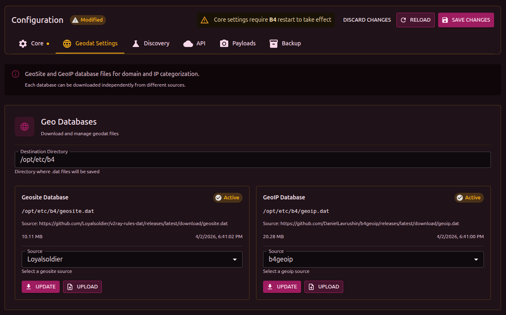

## What GeoSite and GeoIP are

**GeoSite** and **GeoIP** are [V2Ray](https://github.com/v2fly/v2ray-core) format databases that let you work with whole categories of sites and IP addresses instead of adding them one by one.

- **GeoSite** (`sitedat.dat`) - file with domains grouped into categories. For example, the `youtube` category contains every domain related to YouTube (youtube.com, googlevideo.com, ytimg.com, etc.)
- **GeoIP** (`ipdat.dat`) - file with IP ranges grouped by country and ASN

:::info Why it matters
Instead of manually adding dozens of YouTube or Discord domains, you pick the category in the set settings. When the database is updated, new domains are picked up automatically.
:::

## Sources

b4 supports several preset sources and lets you specify a custom URL.

| Source | Contents | Link |
| --- | --- | --- |
| **Loyalsoldier** | Global database of domains and IPs (China + worldwide) | [GitHub](https://github.com/Loyalsoldier/v2ray-rules-dat) |
| **RUNET Freedom** | Database tuned for Russian blocking | [GitHub](https://github.com/runetfreedom/russia-v2ray-rules-dat) |
| **b4geoip** | Official b4 GeoIP database - IP ranges by ASN (GeoIP only) | [GitHub](https://github.com/DanielLavrushin/b4geoip) |

:::tip For users in Russia
Try **RUNET Freedom** for GeoSite (domains) and **b4geoip** for GeoIP (IP ranges).
:::

### b4geoip

The official GeoIP database of the b4 project. It is built automatically from [RIPE NCC](https://stat.ripe.net/) data - actual announced IP prefixes by ASN. It contains categories for:

- **Cloud providers** - AWS, Google Cloud, Azure, DigitalOcean, Hetzner, OVH, Scaleway, Oracle Cloud, Contabo, AEZA
- **CDN** - Cloudflare, Akamai, Fastly, CDN77
- **Gaming companies** - Roblox, Valve/Steam, Sony/PlayStation, Nintendo, EA, Riot Games, Ubisoft, Epic Games, Wargaming, Bungie, Take-Two, CCP
- **Platforms** - Telegram, GitHub, Apple, Adobe, Amazon, Blizzard

Unlike country-based databases, b4geoip groups IPs by service, which allows precise routing of traffic for specific platforms.

## Configuration

1. Go to **Settings -> Geodat settings**
2. Enter the **Destination directory** - where to save the files (default `/etc/b4`)
3. Pick a **Source** from the dropdown or enter a URL manually
4. Click **Download**

The file status is shown next to the name:

- **Active** - the file is found, size and date are shown
- **Not Found** - the file is missing, it has to be downloaded

Files can also be added manually through the **Upload** button (upload a `.dat` file).

:::warning File size
GeoSite and GeoIP files can take up 5-15 MB each. On routers with limited storage, make sure there is enough space.
:::

## Using in sets

After the databases are loaded, the categories become available in set settings (the **Targets** tab):

- **GeoSite categories** - pick domain categories for bypass
- **GeoIP categories** - pick IP categories for bypass

The number of domains/IPs in each category is shown next to it. Click a category to view its contents.

## Updating

Databases are updated manually - go to settings and click **Download** again. No b4 restart is required - new data is picked up automatically.

## Tools

| Project | Description |
| --- | --- |
| [GeodatExplorer](https://github.com/DanielLavrushin/GeodatExplorer) | Web application for viewing the contents of `.dat` files - categories, domains, IP ranges. Helps you understand what a category contains before using it in a set |
| [v2dat](https://github.com/DanielLavrushin/v2dat) | CLI utility for extracting V2Ray `.dat` files into text lists. Useful for scripts and automation |
| [b4geoip](https://github.com/DanielLavrushin/b4geoip) | Official b4 GeoIP database (described [above](#b4geoip)) |
