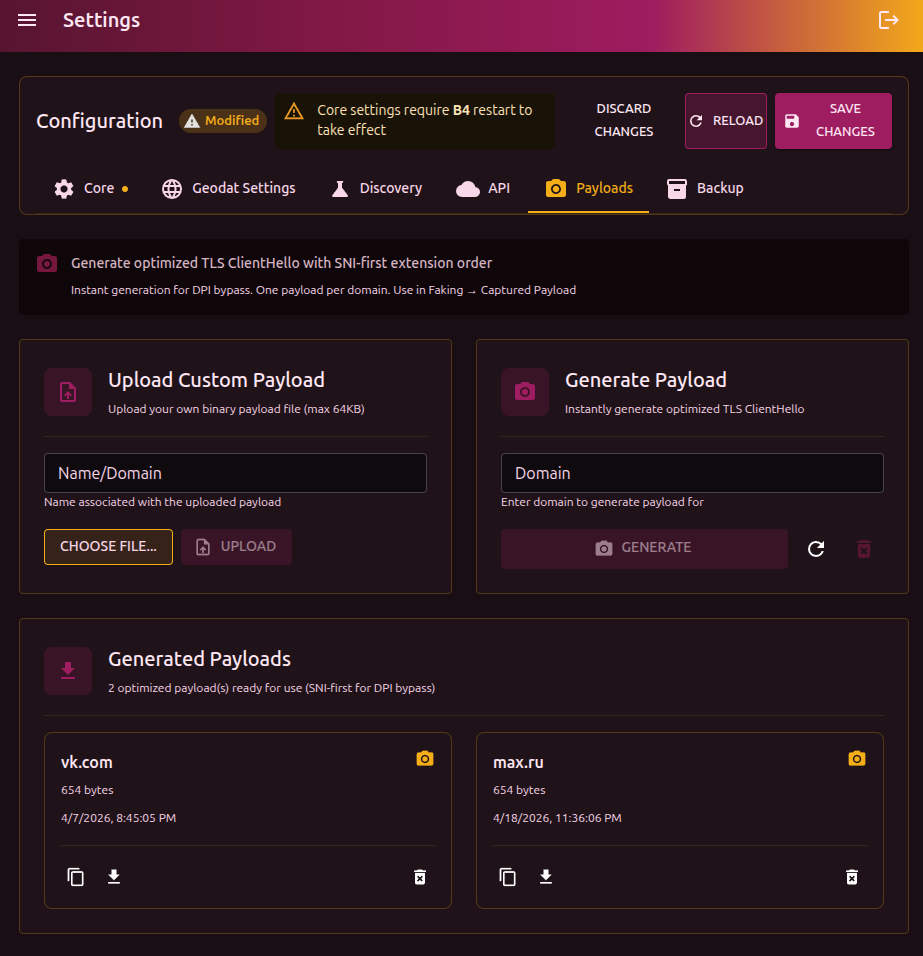
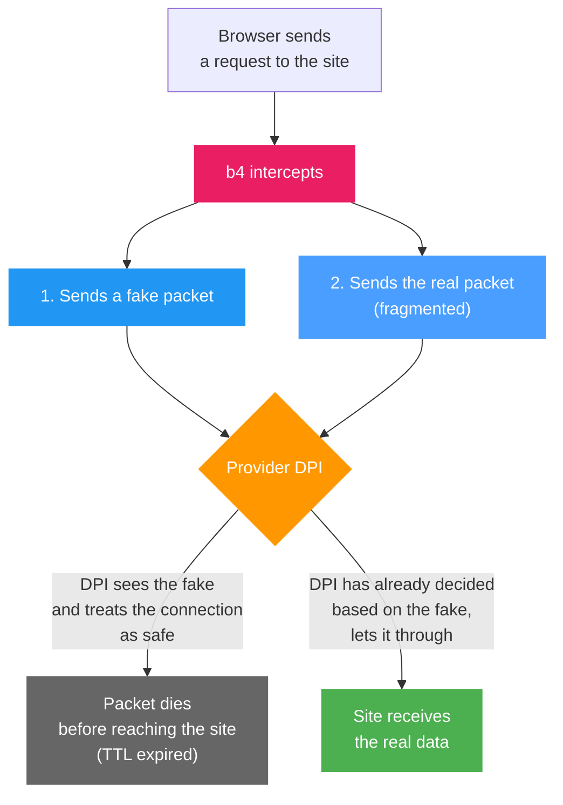

## Why payloads exist

One of the DPI bypass strategies is sending **fake packets** (faking). b4 sends the provider a fake packet with decoy data, and sends the real packet in a way the DPI does not notice. The fake packet has to carry some data - that is the **payload**.

The fake packet is sent with a **reduced TTL** (time to live). It goes through the provider's equipment (the DPI sees and analyzes it), but does not reach the real server - the packet "dies" along the way. The server never sees the junk, and the DPI has already made its decision based on the fake.

## Payload types

b4 supports several content types for fake packets. The type is selected in set settings: **TCP -> Faking -> Payload type**.

| Type | Contents | When to use |
| --- | --- | --- |
| **Random** | 1200 random bytes | Default. Try this first |
| **Google ClientHello** | Prebuilt TLS ClientHello pretending to be Google | If the DPI lets Google traffic through |
| **DuckDuckGo ClientHello** | Prebuilt TLS ClientHello pretending to be DuckDuckGo | Alternative to Google |
| **Captured Payload** | Generated or uploaded payload | For advanced setup (see below) |
| **Zeros** | 1200 zero bytes (0x00) | Minimal CPU load |
| **Inverted** | Bitwise inversion of the original TLS packet | Looks like a corrupted packet |

:::tip Which to pick
Use what discovery suggests. When configuring manually, start with **Random** and try other options if that does not work. DPI behavior depends on the provider and can change over time.
:::

## Generating a payload (Captured Payload)

A generated payload is an **optimized TLS ClientHello** that looks like a real browser TLS handshake. Unlike random bytes, the DPI recognizes it as legitimate TLS and applies different handling rules.

### Why SNI-first

Russian DPI (TSPU) uses an optimization: if the SNI extension in the TLS ClientHello is **first**, the system checks the domain against an allowlist and, if the domain is allowed, routes the connection through a fast path. b4 builds the ClientHello this way - with SNI first - to take advantage of this behavior.

### How to generate

1. Enter the domain in the **Domain** field (for example, `youtube.com`)
2. Click **Generate**

b4 builds a ClientHello with a realistic set of TLS extensions and ciphers, SNI placed first. Generation is instant - no real connection to the site is made. One domain = one payload. Running generate again does not create a duplicate.

### Uploading your own payload

If you have a binary file (`.bin`, up to 64 KB):

1. Enter **Name/Domain** - the payload identifier
2. Click **Choose file** and pick the `.bin`
3. Click **Upload**

:::tip Name from the file
If the file name contains a domain (for example, `tls_youtube_com.bin`), the name field is filled in automatically.
:::

## Using in sets

Once generated, payloads become available in the set settings:

1. Open the set -> **TCP** tab -> **Faking** section
2. In the **Payload type** field pick **Captured Payload**
3. In the list that appears, pick the payload by domain

## Using in discovery

When running discovery you can supply payloads in **Search parameters -> Custom payloads**. Discovery tests every strategy with each of the listed payloads and picks the most effective combination.

:::info When this is useful
If standard discovery (with the Random payload) does not find a working configuration, generate payloads for several domains and run discovery with them. Some providers react to the fake packet's contents, and a realistic ClientHello may work where random bytes did not.
:::

## Management

Each payload is shown as a card with the domain, size, and creation date.

| Action | Description |
| --- | --- |
| View hex | Show the contents in hex, copy to clipboard |
| Download .bin | Download as a binary file |
| Delete | Remove the payload |
| Clear all | Remove every payload (button in the header) |

Payloads are stored in the `captures/` directory inside the b4 configuration directory (usually `/etc/b4/captures/`).
