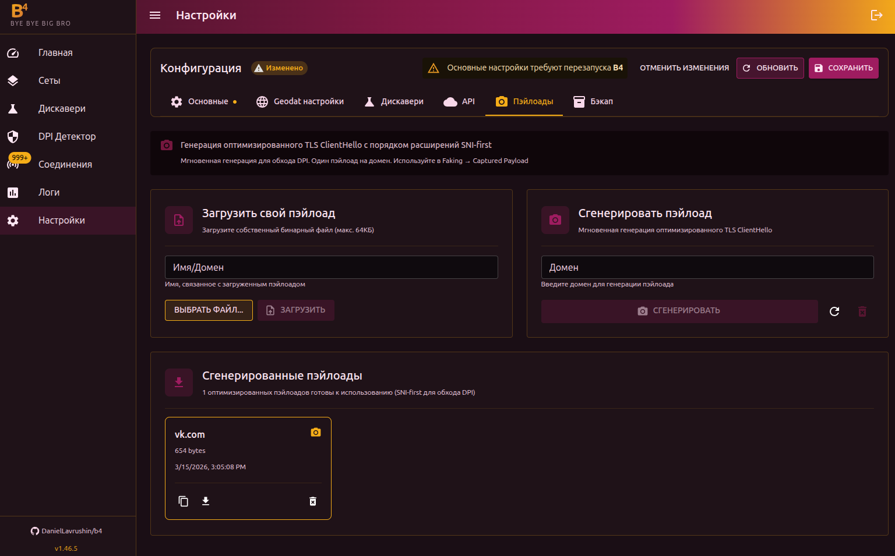
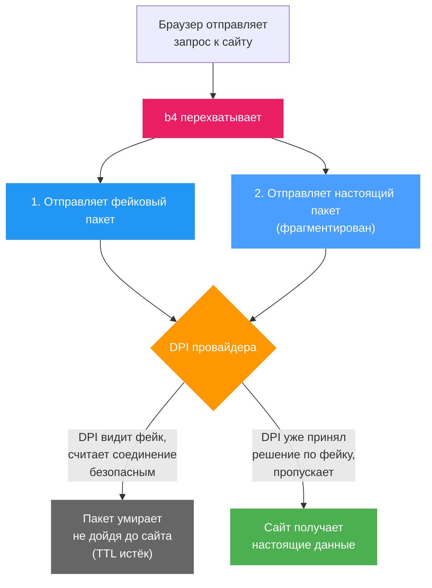

# Пэйлоады

## Зачем нужны пэйлоады

Одна из стратегий обхода DPI — отправка **фейковых пакетов** (faking). b4 отправляет провайдеру поддельный пакет с подменёнными данными, а настоящий пакет отправляет так, чтобы DPI его не заметила. Для этого фейковый пакет должен содержать какие-то данные — это и есть **пэйлоад**.

Фейковый пакет отправляется с **заниженным TTL** (время жизни). Он проходит через оборудование провайдера (DPI его видит и анализирует), но не доходит до настоящего сервера — пакет «умирает» по дороге. Сервер никогда не получает мусор, а DPI уже принял решение на основе фейка.

## Типы пэйлоадов

b4 поддерживает несколько типов содержимого для фейковых пакетов. Тип выбирается в настройках сета: **TCP → Faking → Тип пэйлоада**.

| Тип | Что содержит | Когда использовать |
| --- | --- | --- |
| **Random** | 1200 случайных байтов | По умолчанию. Работает у большинства провайдеров |
| **Google ClientHello** | Готовый TLS ClientHello от имени Google | Если DPI пропускает трафик к Google |
| **DuckDuckGo ClientHello** | Готовый TLS ClientHello от имени DuckDuckGo | Альтернатива Google |
| **Captured Payload** | Сгенерированный или загруженный пэйлоад | Для продвинутой настройки (см. ниже) |
| **Zeros** | 1200 нулевых байтов (0x00) | Минимальная нагрузка на процессор |
| **Inverted** | Побитовая инверсия оригинального TLS-пакета | Выглядит как повреждённый пакет |

:::tip Какой выбрать
Используйте тот тип, который предложил дискавери. Если настраиваете вручную — начните с **Random** и попробуйте другие варианты, если не сработает. Поведение DPI зависит от провайдера и может меняться со временем.
:::

## Генерация пэйлоада (Captured Payload)

Сгенерированный пэйлоад — это **оптимизированный TLS ClientHello**, который выглядит как настоящее TLS-рукопожатие браузера. В отличие от случайных байтов, DPI распознаёт его как легитимный TLS и применяет другие правила обработки.

### Почему SNI-first

Российские DPI (ТСПУ) используют оптимизацию: если в TLS ClientHello расширение SNI стоит **первым**, система проверяет домен по белому списку и, если домен разрешён — пропускает соединение по ускоренному пути. b4 генерирует ClientHello именно так — SNI на первом месте — чтобы использовать эту особенность.

### Как сгенерировать

1. Введите домен в поле **Домен** (например, `youtube.com`)
2. Нажмите **Сгенерировать**

b4 создаст ClientHello с реалистичным набором TLS-расширений и шифров, SNI на первом месте. Генерация мгновенная — реальное соединение с сайтом не устанавливается. Один домен — один пэйлоад. Повторная генерация не создаст дубликат.

### Загрузка своего пэйлоада

Если у вас есть бинарный файл (`.bin`, до 64 КБ):

1. Укажите **Имя/Домен** — идентификатор пэйлоада
2. Нажмите **Выбрать файл** и выберите `.bin`
3. Нажмите **Загрузить**

:::tip Имя из файла
Если имя файла содержит домен (например, `tls_youtube_com.bin`), поле имени заполнится автоматически.
:::

## Использование в сетах

После генерации пэйлоады становятся доступны в настройках сета:

1. Откройте сет → вкладка **TCP** → секция **Faking**
2. В поле **Тип пэйлоада** выберите **Captured Payload**
3. В появившемся списке выберите нужный пэйлоад по домену

## Использование в дискавери

При запуске дискавери можно указать пэйлоады в **Параметрах поиска → Пользовательские payloads**. Дискавери протестирует каждую стратегию с каждым из указанных пэйлоадов и выберет наиболее эффективную комбинацию.

:::info Когда это полезно
Если стандартный дискавери (с Random-пэйлоадом) не находит рабочую конфигурацию — сгенерируйте пэйлоады для нескольких доменов и запустите дискавери с ними. Некоторые провайдеры реагируют на содержимое фейкового пакета, и реалистичный ClientHello может сработать там, где случайные байты не помогли.
:::

## Управление

Каждый пэйлоад отображается как карточка с доменом, размером и датой создания.

| Действие | Описание |
| --- | --- |
| Просмотр hex | Показать содержимое в hex-формате, скопировать в буфер |
| Скачать .bin | Скачать как бинарный файл |
| Удалить | Удалить пэйлоад |
| Очистить все | Удалить все пэйлоады (кнопка в заголовке) |

Пэйлоады хранятся в директории `captures/` внутри директории конфигурации b4 (обычно `/etc/b4/captures/`).
