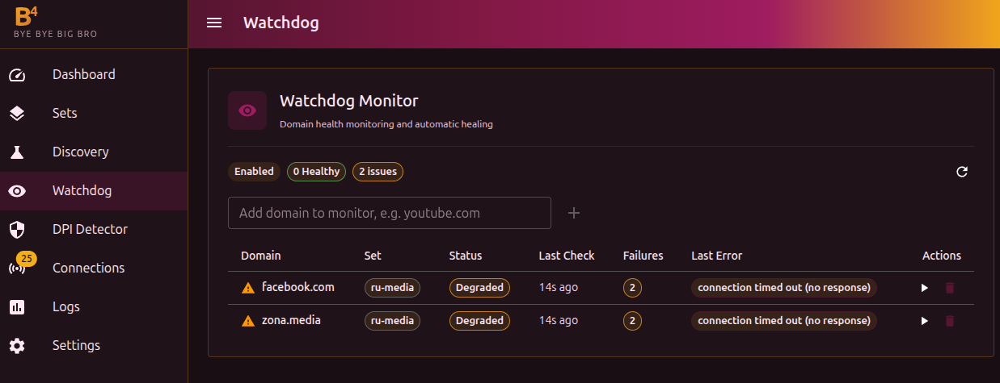
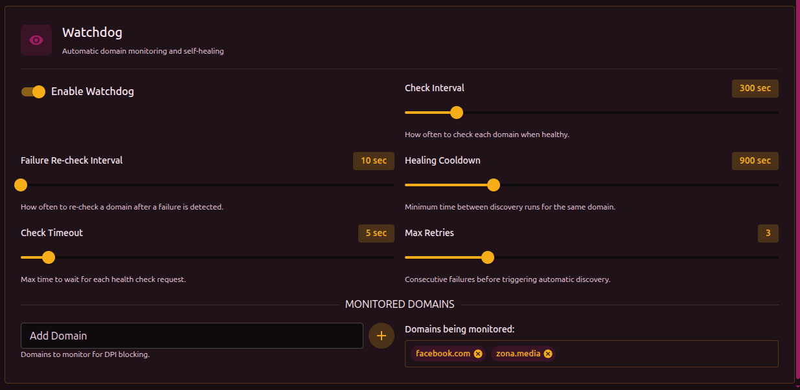

# Мониторинг доменов (Watchdog)

Мониторинг периодически проверяет доступность указанных доменов и при обнаружении блокировки автоматически запускает [дискавери](./discovery) для поиска рабочей конфигурации.

Настройки мониторинга находятся в **Настройки → Дискавери → раздел Мониторинг**.

## Как это работает

1. Мониторинг с заданным интервалом делает HTTP-запрос к каждому домену из списка
2. Если домен не отвечает или обнаружена страница блокировки — фиксируется ошибка
3. После нескольких последовательных ошибок (настраивается) мониторинг автоматически запускает дискавери для этого домена
4. Найденная конфигурация применяется к существующему сету или создаётся новый

## Параметры

| Параметр | Описание | По умолчанию |
| --- | --- | --- |
| Интервал проверки | Как часто проверять домены, когда всё работает | `300` сек (5 мин) |
| Интервал при ошибке | Как часто проверять, если домен уже в статусе «Проблема» | `60` сек |
| Кулдаун | Пауза после попытки восстановления перед возобновлением обычных проверок | `900` сек (15 мин) |
| Таймаут | Максимальное время ожидания ответа от домена | `15` сек |
| Макс. попыток | Сколько ошибок подряд нужно для запуска автовосстановления | `3` |

## Статусы доменов

| Статус | Значение |
| --- | --- |
| **Доступен** | Домен отвечает нормально |
| **Проблема** | Зафиксированы ошибки, но порог для восстановления ещё не достигнут |
| **Восстановление** | Запущен дискавери для поиска рабочей конфигурации |
| **В очереди** | Домен ожидает следующей проверки |

## Добавление доменов

Домены можно добавлять двумя способами:

- Через панель «Мониторинг доменов» на главной — поле ввода с кнопкой «+»
- Через **Настройки → Дискавери → раздел Мониторинг**

Можно указать как домен (например, `youtube.com`), так и полный URL (например, `https://youtube.com/watch?v=test`). Если указан URL — мониторинг будет проверять именно этот адрес. Если указан только домен — проверяется `https://домен/`.

:::tip Какие домены добавлять
Добавляйте домены, которые вы реально используете и которые могут быть заблокированы. Мониторинг проверяет именно HTTP-доступность, поэтому домен должен отвечать по HTTP/HTTPS.
:::

:::warning Мониторинг и дискавери
Если дискавери уже запущен вручную, мониторинг не будет запускать параллельный процесс — он дождётся завершения текущего.
:::
